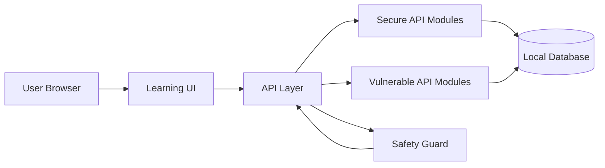
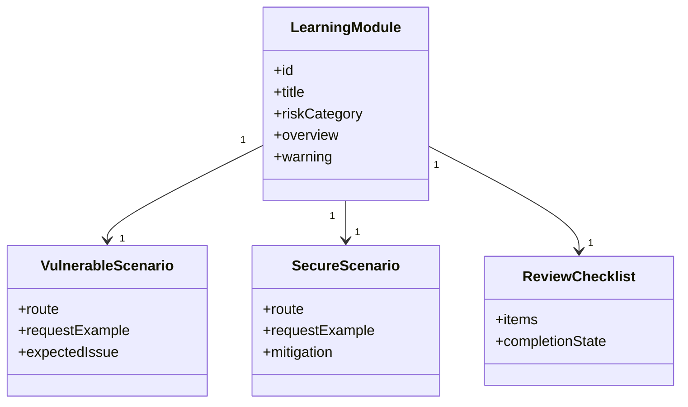
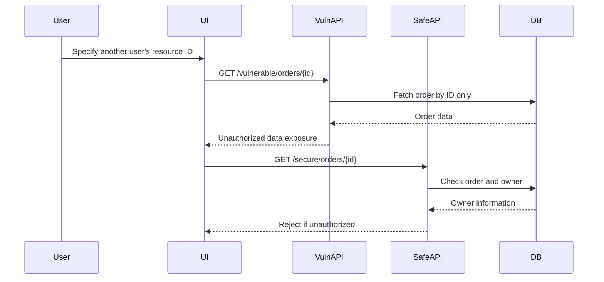
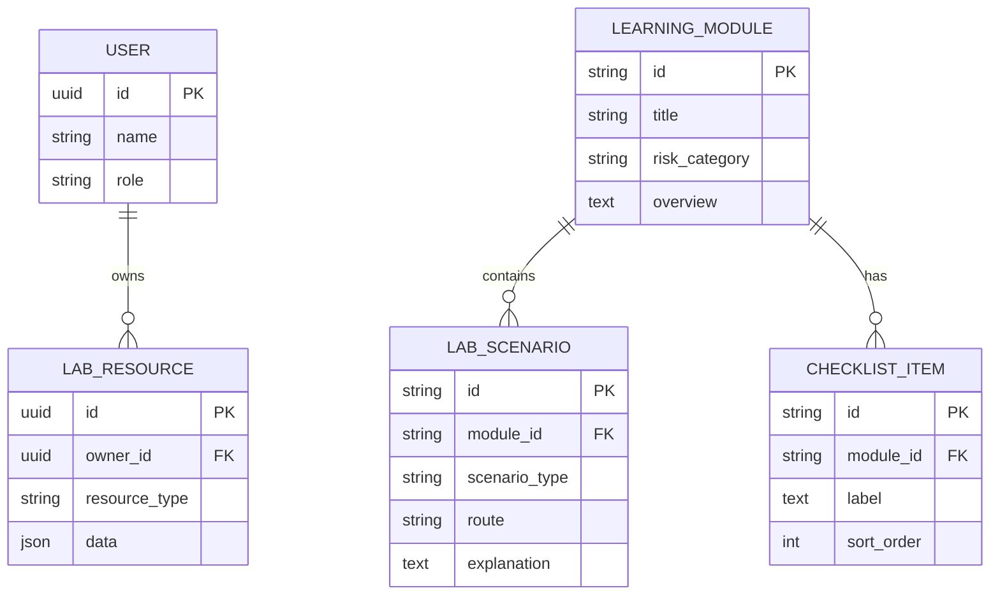
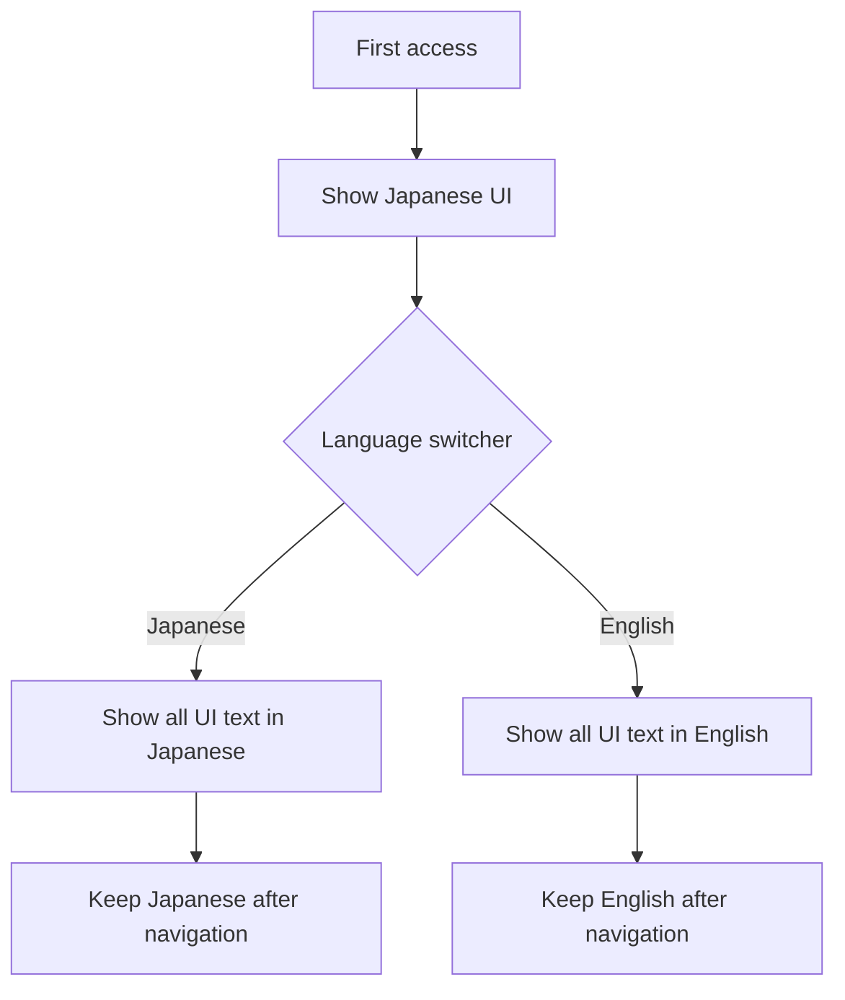

# API Security Lab Platform Design

## Technology Selection

The initial implementation prioritizes clear API specifications, request validation, authentication and authorization, rate limiting, and isolation of vulnerable demos. The current implementation uses:

- Frontend: TypeScript + React + Next.js App Router
- Backend: Next.js Route Handlers
- Package manager: npm with `package-lock.json`
- Validation: Zod
- Testing: Vitest
- Linting and formatting: ESLint and Prettier
- API Documentation: OpenAPI, to be added as API modules are implemented
- Database and ORM: SQLite and Prisma are planned for lab data in later phases

TypeScript is suitable because API requests, responses, authorization targets, and learning modules can be managed with types. OpenAPI will document API specifications and verification perspectives as the module APIs become concrete.

## Architecture

## Module Structure

## BOLA Verification Sequence

## Data Model

## Security Design

- Vulnerable APIs are clearly separated under paths such as `/vulnerable/*`, while secure APIs use paths such as `/secure/*`.
- `LAB_MODE=local` is required for vulnerable APIs, and vulnerable APIs are disabled when `NODE_ENV=production`.
- Screens that operate vulnerable APIs always display local-only warnings.
- Secure APIs validate user ID, role, and target resource ownership in the API layer.
- SSRF protection includes allowlists, private IP range rejection, redirect restrictions, and timeouts.
- Rate limiting is considered per user, per IP address, and per API route.

The initial route separation is represented by `/api/vulnerable/health` and `/api/secure/health`. The vulnerable health route uses the shared safety guard before returning a response.

## Multilingual UI Design

The default UI language is Japanese. A shared language switcher should be placed in the common header or navigation area on every screen. The selected language is shared across the application and persists across screen transitions.

- Learning module names, warnings, request explanations, response explanations, mitigations, and checklist items are translation targets.
- Japanese mode uses Japanese UI text, and English mode uses English UI text.
- Common technical terms such as API, BOLA, SSRF, Mass Assignment, and OWASP may remain in English in Japanese mode.
- UI text is managed in `src/lib/i18n.ts`, and learning module content is managed in `src/data/learning-modules.ts`.

## Screen Design

- Topic list: displays risk category, difficulty, progress, summary, and selected state for each module.
- Learning detail: displays overview, vulnerable condition, and defensive design for the selected module.
- Comparison view: displays side-by-side route, request, response, and design notes for vulnerable and secure APIs.
- Checklist: displays defensive review points for the selected module. Progress persistence is planned for a later phase.
- Vulnerable comparison areas always display local-only and non-public deployment warnings.
