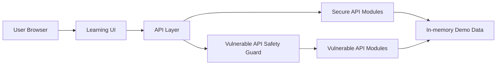
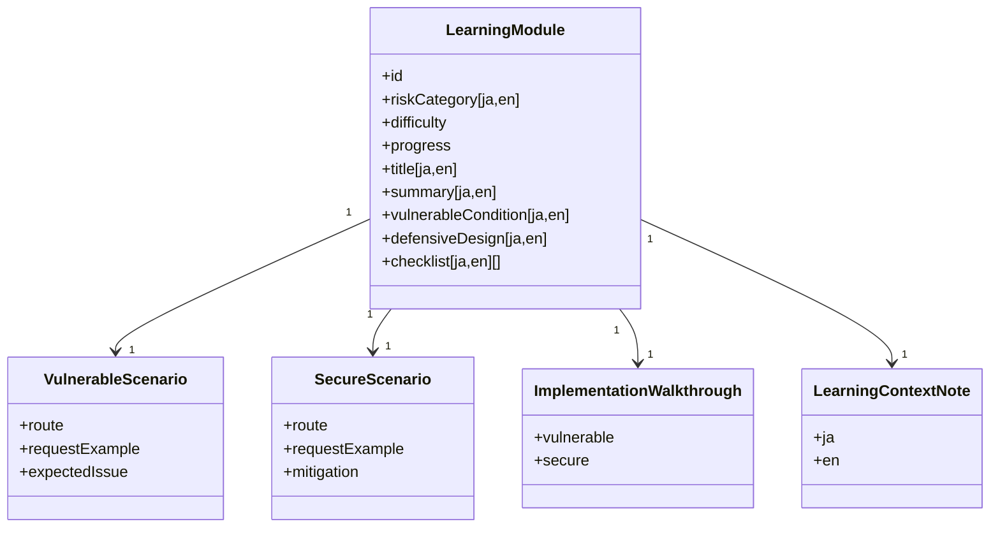
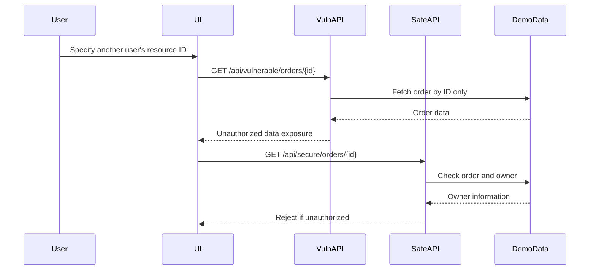
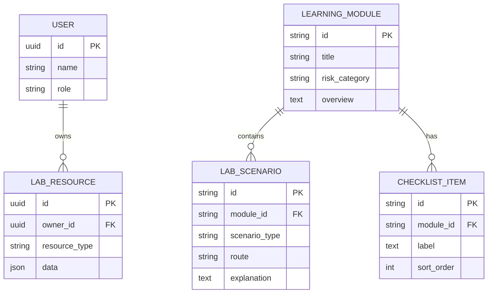
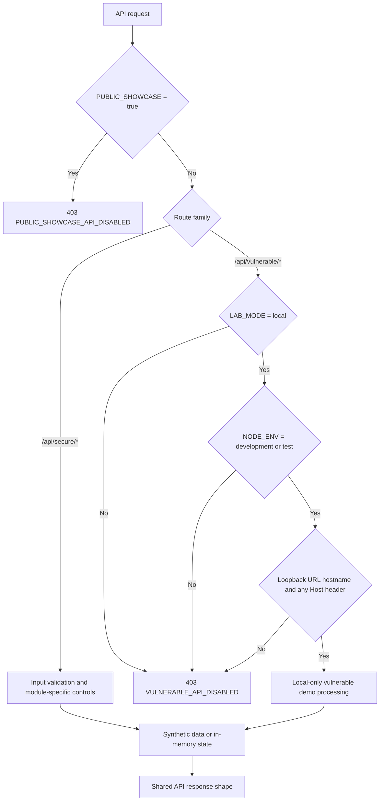
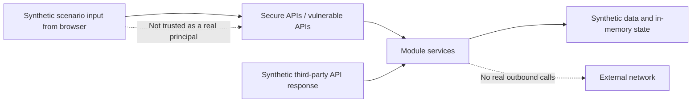
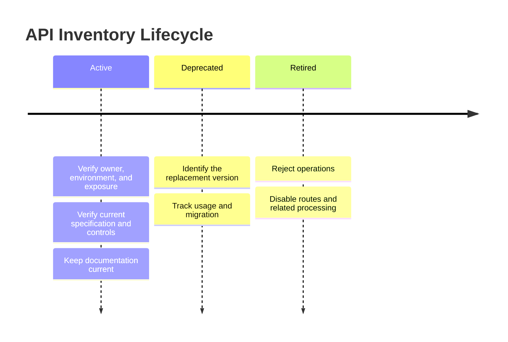
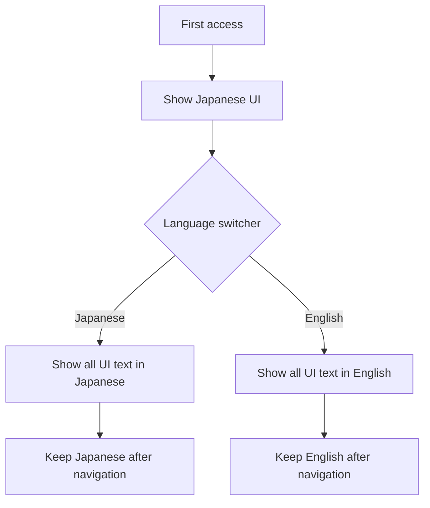

# API Security Lab Platform Design

## Technology Selection

The current implementation prioritizes clear API specifications, request validation, authentication and authorization, rate limiting, and isolation of vulnerable demos. It uses:

- Frontend: TypeScript + React + Next.js App Router
- Backend: Next.js Route Handlers
- Package manager: npm with `package-lock.json`
- Validation: Zod
- Testing: Vitest
- Linting and formatting: ESLint and Prettier
- API Documentation: OpenAPI in `docs/api/openapi.json`
- Public runtime: Cloudflare Workers through OpenNext, in read-only public showcase mode
- Database and ORM: not introduced; current demos use in-memory state and synthetic data

TypeScript is suitable because API requests, responses, authorization targets, and learning modules can be managed with types. OpenAPI documents implemented API specifications and verification perspectives.

## Architecture

Current demo data is managed as synthetic data under `src/data/`. Persistence is outside the current implementation scope.

## Module Structure

## BOLA Verification Sequence

## Future Concept: Persistence Data Model (Not Implemented)

The following is a conceptual model for a future persistence layer. The current implementation uses synthetic local demo data instead of a real database.

## Security Design

- Vulnerable APIs are clearly separated under `/api/vulnerable/*`, while secure APIs use `/api/secure/*`.
- Vulnerable APIs default to disabled and require `LAB_MODE=local`, `NODE_ENV` exactly `development` or `test`, a loopback request URL hostname, and a loopback `Host` header when present. Invalid `LAB_MODE` values are treated as disabled. Development and start commands bind only to `127.0.0.1`. Hostname checks do not prove the connection source and must not be treated as making a publicly forwarded server safe.
- Screens that operate vulnerable APIs always display warnings that they are local-only and must not be publicly exposed.
- Secure APIs validate user ID, role, and target resource ownership in the API layer.
- Broken Function Level Authorization protection validates required feature permissions for administrative functions with deny-by-default behavior.
- Sensitive Business Flows protection validates workflow order, per-user limits, stock constraints, and automation-abuse signals for critical reservation or purchase flows in the API layer.
- SSRF protection returns validation previews for allowlists, private host rejection, redirect policy, and timeout policy without real network access.
- Security Misconfiguration protection suppresses debug details, compares the actual `Origin` header with the request target for same-origin access, disables diagnostic caching, and sets security response headers. The body `requestedOrigin` remains a synthetic audit-scenario input and is never used for authorization.
- Unsafe Consumption of APIs protection treats third-party API responses as `unknown` and validates a strict Zod schema, provider identity, the complete HTTPS origin, actual payload size, and privileged fields.
- Improper Inventory Management protection validates API environment, version, exposure, owner, documentation freshness, lifecycle state, and protection parity before processing.
- Rate limiting allows three requests per 60-second bucket for a finite set of known demo users and API routes, then rejects the fourth with 429. It removes expired buckets and caps the in-memory store at 100 entries. Cross-process sharing and per-source limits are outside the current implementation scope.
- HTML responses apply CSP, frame denial, MIME-sniffing prevention, referrer restrictions, and Permissions Policy. API responses add `Cache-Control: no-store`.
- Public showcase mode is enabled with `PUBLIC_SHOWCASE=true`. Middleware rejects every `/api/*` request before route handling, including secure routes. The UI keeps a bilingual read-only notice and lets users load static synthetic results into the existing result panels without calling `fetch`. Any non-empty value other than explicit `false` enables the fail-closed public boundary.
- CI forces `LAB_MODE=disabled` and `PUBLIC_SHOWCASE=true`, sequentially runs dependency and application checks, builds the OpenNext Worker once, performs a Wrangler dry run, and verifies the public API boundary over HTTP in workerd. The verified `.open-next` artifact is passed unchanged to the deploy job. Cloudflare credentials are exposed only to the final deploy step, which runs only after verification and only when explicitly enabled at the repository level.

### Route Separation And Vulnerable API Safety Guard

Secure APIs process synthetic data only after module-specific validation succeeds. Vulnerable APIs additionally pass through the shared safety guard and cannot reach demo processing unless the local learning environment conditions are satisfied.

Route separation is represented by `/api/vulnerable/*` and `/api/secure/*` route handlers for health checks, lab samples, BOLA orders, authentication sessions, rate-limit search, admin invitations, business-flow reservations, profile updates, URL fetch previews, configuration diagnostics, API inventory operations, and third-party profile imports. Vulnerable routes use the shared safety guard before returning a response.

### Cloudflare Public Showcase

- `@opennextjs/cloudflare` converts the Next.js application into `.open-next/worker.js`; Wrangler serves generated static assets from `.open-next/assets`.
- `wrangler.jsonc` fixes the public runtime to `LAB_MODE=disabled`, `NODE_ENV=production`, and `PUBLIC_SHOWCASE=true`.
- GitHub Actions keeps Cloudflare credentials in repository secrets and does not place account identifiers or API tokens in tracked files.
- The public site exposes only learning content, request examples, synthetic response examples, design differences, and implementation flows. Live secure and vulnerable API execution remains unavailable.
- `src/data/showcase-results.ts` contains stable synthetic response envelopes for every learning module. The public action copies these values into client state and reuses the local demo result panels; it does not invoke route handlers or service functions.

## API Foundation

- Shared API response helpers are defined in `src/lib/api-response.ts` and return `{ ok, data, meta }` for success or `{ ok, error, meta }` for errors.
- Shared request validation is defined in `src/lib/request-validation.ts`. JSON bodies allow only `application/json` with optional `charset=utf-8`, must contain valid UTF-8 and JSON, and have both declared and actual sizes capped at 16 KiB before Zod schemas run. Invalid UTF-8 or JSON, oversized bodies, and unsupported content types map to consistent 400, 413, and 415 errors. Repeated scalar query values become arrays and fail validation instead of using last-value-wins behavior.
- Local sample users and resources are defined in `src/data/lab-samples.ts`. They use synthetic demo identifiers and do not include real personal data, logs, credentials, or tokens.
- `src/lib/lab-sample-service.ts` provides filtered sample data for API modules without introducing database dependencies before persistence is added.
- `docs/api/openapi.json` documents implemented routes, separated secure/vulnerable tags, shared success/error response shapes, and local-only vulnerable route behavior.

### Demo Trust Boundary

The `userId`, `actorUserId`, and demo token IDs in this lab are finite synthetic scenario inputs used to compare authentication and authorization patterns. They are not sessions or Bearer tokens that authenticate real users, and each secure API example is scoped to the defensive concern of that module. A real service must derive its principal from a server-validated session or signed token and must never use a client-supplied ID as the authenticated principal.

The in-memory rate limits, reservation totals, stock, and attempt counters are single-process local-demo controls. Multi-instance or persistent operation additionally requires an atomic shared store, trustworthy source identification, audit logging, key management, and TLS termination.

## BOLA Module Design

- The vulnerable BOLA route `/api/vulnerable/orders/{orderId}` intentionally fetches a local demo order by ID only after the local-only safety guard passes.
- The secure BOLA route `/api/secure/orders/{orderId}` requires `userId` and verifies that the requested order belongs to that demo user.
- The comparison UI runs `order-demo-002` as a user who does not own it, so the vulnerable route returns the order while the secure route returns `403 FORBIDDEN`.
- The BOLA implementation uses synthetic demo users and resources only; it does not use real accounts, orders, logs, or tokens.

## Authentication Module Design

- The vulnerable authentication route `/api/vulnerable/auth/session` accepts a known demo token by ID only after the local-only safety guard passes.
- The secure authentication route `/api/secure/auth/session` validates demo token signature state, expiration, revocation state, and required permission before accepting a session.
- The comparison UI uses `demo-token-expired-admin`, which has an invalid signature, is expired, and is revoked. The vulnerable route accepts it, while the secure route returns `401 UNAUTHORIZED`.
- The authentication module uses synthetic token identifiers and metadata only; it does not contain real tokens, signing keys, secrets, credentials, or user sessions.

## Rate Limiting, Mass Assignment, And SSRF Module Design

- The vulnerable rate-limit route `/api/vulnerable/rate-limit/search` accepts repeated requests without applying limits. The secure route `/api/secure/rate-limit/search` allows three requests in a 60-second bucket keyed by route and demo user, then returns `429 RATE_LIMITED` for the fourth.
- The vulnerable Mass Assignment route `/api/vulnerable/profile` applies all accepted properties, including privileged fields such as `ownerId` and `role`. The secure route `/api/secure/profile` restricts normal updates to allowlisted profile fields and returns 403 when privileged or ownership fields are present.
- The vulnerable SSRF route `/api/vulnerable/fetch-url` accepts arbitrary URLs for demonstration without real outbound network access. The secure route `/api/secure/fetch-url` returns a preview that requires HTTPS, rejects private hosts, and allows only `api.example.test`.
- SSRF demos never perform real outbound network access; both vulnerable and secure routes return preview metadata only.

## Broken Function Level Authorization Module Design

- The vulnerable admin invitation route `/api/vulnerable/admin/invitations` accepts a synthetic administrative invitation request without checking feature-level permission after the local-only safety guard passes.
- The secure admin invitation route `/api/secure/admin/invitations` validates the actor role and `admin:invitations:create` permission before returning an invitation preview.
- The comparison UI runs the request as `user-demo-alice`, a learner without administrative permission. The vulnerable route accepts the request, while the secure route returns `403 FORBIDDEN`.
- The function authorization demo uses synthetic actor and invitation metadata only; it does not send real email, create real accounts, use real personal data, or integrate with external services.

## Sensitive Business Flows Module Design

- The vulnerable business-flow route `/api/vulnerable/business-flow/reservations` accepts limited-product reservation requests without workflow order or per-user limit checks after the local-only safety guard passes.
- The secure business-flow route `/api/secure/business-flow/reservations` increments a per-user/product automation-attempt counter for every attempt, validates workflow order, cumulative quantity limits, and stock, then updates remaining stock and cumulative reservations only on success. The vulnerable preview does not update this secure state.
- The comparison UI attempts to reserve four units of `product-demo-001` through `direct-checkout`. The vulnerable route accepts the request, while the secure route returns `403 FORBIDDEN`.
- The business-flow demo uses synthetic limited-product data only; it does not use real products, orders, payments, personal data, or external service integrations.

## Security Misconfiguration Module Design

- The vulnerable configuration diagnostics route `/api/vulnerable/config/diagnostics` returns synthetic debug settings, a synthetic stack trace, and permissive CORS response metadata after the local-only safety guard passes.
- When an actual `Origin` header is present, the secure configuration diagnostics route `/api/secure/config/diagnostics` requires an exact match with the request URL origin and does not enable cross-origin access. Requests without `Origin`, such as non-browser clients, are accepted. It sends no `Access-Control-Allow-Origin`, suppresses debug details, disables caching, and applies security response headers.
- The comparison UI places `https://untrusted.example` in the body `requestedOrigin` as a synthetic audit-scenario input. The vulnerable route returns debug details and synthetic metadata for an overly broad CORS policy. The secure route compares the actual `Origin` header with the request target, returns only public diagnostics for same-origin requests, and returns `403 FORBIDDEN` when the actual origin differs.
- The security misconfiguration demo uses synthetic diagnostic metadata only; it does not expose real configuration, secrets, personal data, internal logs, or real stack traces.

## Unsafe Consumption of APIs Module Design

- The vulnerable third-party profile import route `/api/vulnerable/third-party/profile-import` imports redirect targets and privileged fields from synthetic third-party API responses without validation after the local-only safety guard passes.
- The secure third-party profile import route `/api/secure/third-party/profile-import` validates provider identity, TLS assumptions, redirect allowlists, payload size, response schema, and privileged fields before importing data.
- The comparison UI attempts to import `partner-response-redirect-admin`. The vulnerable route accepts the admin role and unallowed redirect target, while the secure route returns `403 FORBIDDEN`.
- The third-party API response demo performs no real external API calls and uses synthetic external responses only. It does not use real partners, personal data, credentials, or external service integrations.

## Improper Inventory Management Module Design

- The vulnerable API inventory route `/api/vulnerable/inventory/operations` processes a retired legacy API operation without lifecycle or exposure checks after the local-only safety guard passes.
- The secure API inventory route `/api/secure/inventory/operations` validates API environment, version, exposure, owner, documentation freshness, lifecycle state, and protection parity, then rejects retired or unmanaged operations.
- The comparison UI attempts to run `legacy-token-reset-v1` in `production`. The vulnerable route creates a preview, while the secure route returns `403 FORBIDDEN`.
- The API inventory demo uses synthetic inventory and operation results only. It does not issue real tokens, send notifications, use real user data, use real logs, or integrate with external services.

The following diagram shows the conceptual lifecycle managed by the API inventory. It is not a delivery schedule or publication plan; it represents the states and governance checks evaluated by the secure API before an operation.

## Multilingual UI Design

The default UI language is Japanese. A shared language switcher should be placed in the common header or navigation area on every screen. The selected language is shared across the application and persists across screen transitions.

- Learning module names, warnings, request explanations, response explanations, mitigations, and checklist items are translation targets.
- Japanese mode uses Japanese UI text, and English mode uses English UI text.
- Common technical terms such as API, BOLA, SSRF, Mass Assignment, and OWASP may remain in English in Japanese mode.
- UI text is managed in `src/lib/i18n.ts`, and learning module content is managed in `src/data/learning-modules.ts`.
- The shared header groups the language switcher with labeled sun and moon theme controls. The selected `light` or `dark` value is applied to the root `data-theme` attribute and stored in optional local storage; an early initialization script prevents a light-theme flash before hydration. If storage is blocked, the in-memory selection remains usable.

## Security Verification Design

- `src/lib/security-verification.test.ts` verifies across all vulnerable APIs that production-like settings return `403 VULNERABLE_API_DISABLED`.
- The same test verifies that secure APIs do not reproduce BOLA, weak authentication, missing rate limiting, broken function-level authorization, business-flow abuse, Mass Assignment, SSRF, security misconfiguration, legacy API inventory gaps, or overtrusted third-party response behavior.
- `src/lib/openapi.test.ts` verifies that every vulnerable API operation documents local-only behavior and the disabled response for production-like settings.
- UI text resources are tested for matching Japanese and English key structures to avoid mixed-language shared screen labels.
- `src/lib/public-showcase.test.ts` verifies the pre-route shutdown for both API families. Component tests verify no-network synthetic result rendering, and static-data tests cover every module. OpenNext build, Wrangler dry run, and CI workerd HTTP checks verify the exact artifact passed to deployment.

## Screen Design

- Topic list: displays risk category, difficulty, progress, summary, and selected state for each module.
- Learning detail: displays overview, vulnerable condition, and defensive design for the selected module.
- Comparison view: displays side-by-side route, request, response, design notes, and implementation flow for vulnerable and secure APIs. The implementation flow shows the full API program flow and highlights problem areas in `/api/vulnerable/*` in red and improvements in `/api/secure/*` in blue.
- Checklist: displays defensive review points for the selected module. Progress is not currently saved.
- Vulnerable comparison areas always display local-only and non-public deployment warnings.
- Web Storage persistence for language, theme, and opening state is optional; blocked storage falls back to the defaults and a usable application screen.
- Network or JSON failures during API demos always clear the running state and announce a localized error.
