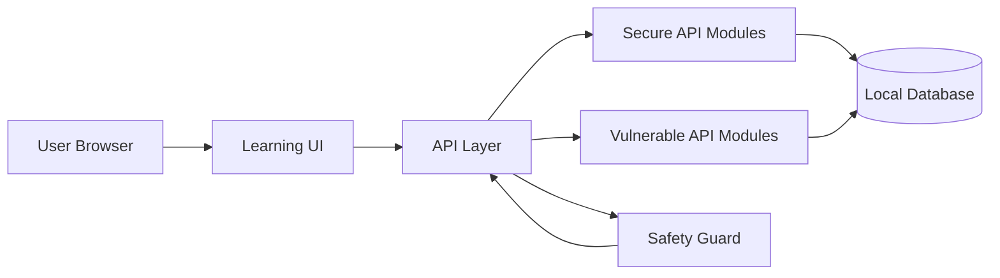
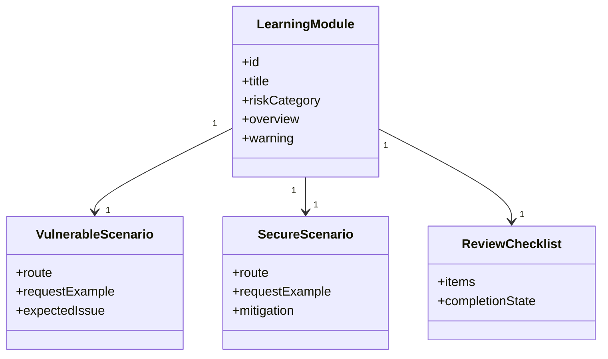
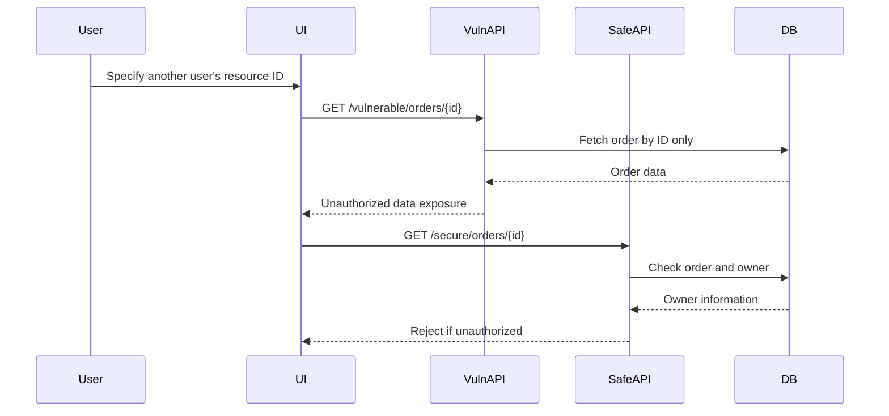
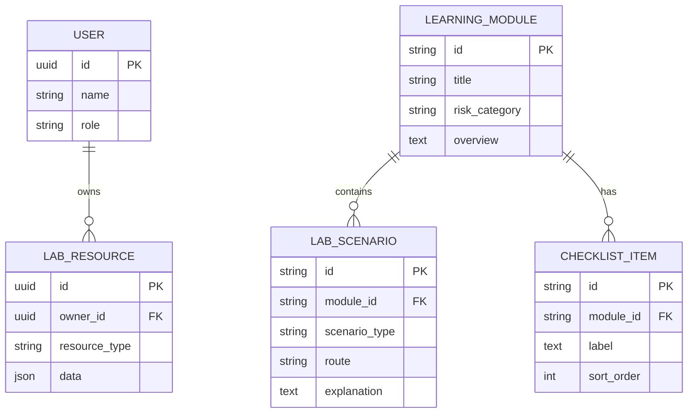
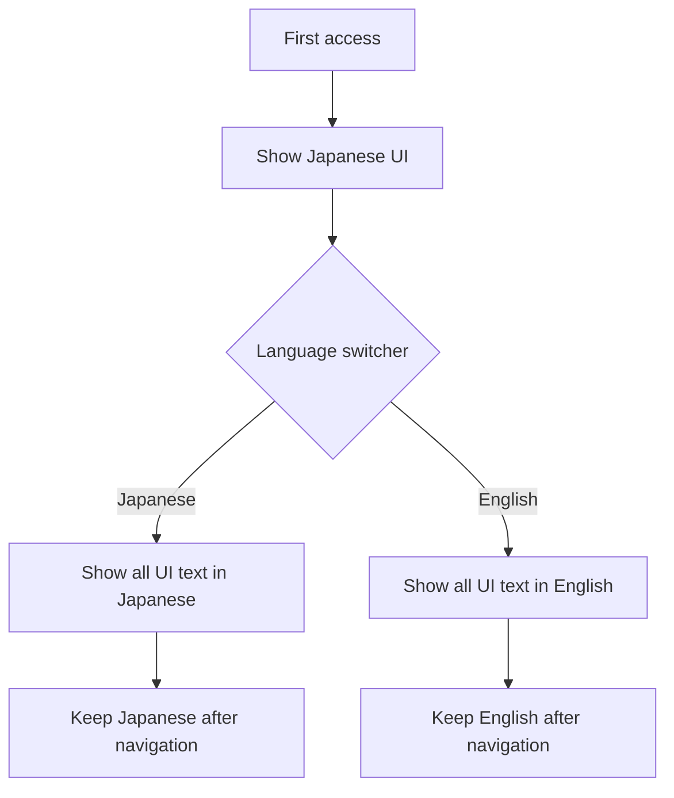

# API Security Lab Platform Design

## Technology Selection

The initial implementation prioritizes clear API specifications, request validation, authentication and authorization, rate limiting, and isolation of vulnerable demos. The current implementation uses:

- Frontend: TypeScript + React + Next.js App Router
- Backend: Next.js Route Handlers
- Package manager: npm with `package-lock.json`
- Validation: Zod
- Testing: Vitest
- Linting and formatting: ESLint and Prettier
- API Documentation: OpenAPI in `docs/api/openapi.json`
- Database and ORM: SQLite and Prisma are planned for lab data in later phases

TypeScript is suitable because API requests, responses, authorization targets, and learning modules can be managed with types. OpenAPI will document API specifications and verification perspectives as the module APIs become concrete.

## Architecture

## Module Structure

## BOLA Verification Sequence

## Data Model

## Security Design

- Vulnerable APIs are clearly separated under paths such as `/vulnerable/*`, while secure APIs use paths such as `/secure/*`.
- `LAB_MODE=local` is required for vulnerable APIs, and vulnerable APIs are disabled when `NODE_ENV=production`.
- Screens that operate vulnerable APIs always display local-only warnings.
- Secure APIs validate user ID, role, and target resource ownership in the API layer.
- SSRF protection includes allowlists, private IP range rejection, redirect restrictions, and timeouts.
- Rate limiting is considered per user, per IP address, and per API route.

The initial route separation is represented by `/api/vulnerable/*` and `/api/secure/*` route handlers for health checks, lab samples, BOLA orders, authentication sessions, rate-limit search, profile updates, and URL fetch previews. Vulnerable routes use the shared safety guard before returning a response.

## API Foundation

- Shared API response helpers are defined in `src/lib/api-response.ts` and return `{ ok, data, meta }` for success or `{ ok, error, meta }` for errors.
- Shared request validation is defined in `src/lib/request-validation.ts` and uses Zod schemas from `src/lib/api-schemas.ts`.
- Local sample users and resources are defined in `src/data/lab-samples.ts`. They use synthetic demo identifiers and do not include real personal data, logs, credentials, or tokens.
- `src/lib/lab-sample-service.ts` provides filtered sample data for API modules without introducing database dependencies before the persistence phase.
- `docs/api/openapi.json` documents the current support routes, separated secure/vulnerable tags, shared success/error response shapes, and local-only vulnerable route behavior.

## BOLA Module Design

- The vulnerable BOLA route `/api/vulnerable/orders/{orderId}` intentionally fetches a local demo order by ID only after the local-only safety guard passes.
- The secure BOLA route `/api/secure/orders/{orderId}` requires `userId` and verifies that the requested order belongs to that demo user.
- The comparison UI runs `order-demo-002` as a user who does not own it, so the vulnerable route returns the order while the secure route returns `403 FORBIDDEN`.
- The BOLA implementation uses synthetic demo users and resources only; it does not use real accounts, orders, logs, or tokens.

## Authentication Module Design

- The vulnerable authentication route `/api/vulnerable/auth/session` accepts a known demo token by ID only after the local-only safety guard passes.
- The secure authentication route `/api/secure/auth/session` validates demo token signature state, expiration, revocation state, and required permission before accepting a session.
- The comparison UI uses `demo-token-expired-admin`, which has an invalid signature, is expired, and is revoked. The vulnerable route accepts it, while the secure route returns `401 UNAUTHORIZED`.
- The authentication module uses synthetic token identifiers and metadata only; it does not contain real tokens, signing keys, secrets, credentials, or user sessions.

## Rate Limiting, Mass Assignment, And SSRF Module Design

- The vulnerable rate-limit route `/api/vulnerable/rate-limit/search` accepts repeated requests without applying limits. The secure route `/api/secure/rate-limit/search` applies a route and demo-user keyed in-memory limit and returns `429 RATE_LIMITED` after the demo threshold.
- The vulnerable Mass Assignment route `/api/vulnerable/profile` applies all accepted properties, including privileged fields such as `ownerId` and `role`. The secure route `/api/secure/profile` applies only allowlisted profile fields and reports rejected properties.
- The vulnerable SSRF route `/api/vulnerable/fetch-url` accepts arbitrary URLs for demonstration. The secure route `/api/secure/fetch-url` requires HTTPS, rejects private hosts, and allows only `api.example.test`.
- SSRF demos never perform real outbound network access; both vulnerable and secure routes return preview metadata only.

## Multilingual UI Design

The default UI language is Japanese. A shared language switcher should be placed in the common header or navigation area on every screen. The selected language is shared across the application and persists across screen transitions.

- Learning module names, warnings, request explanations, response explanations, mitigations, and checklist items are translation targets.
- Japanese mode uses Japanese UI text, and English mode uses English UI text.
- Common technical terms such as API, BOLA, SSRF, Mass Assignment, and OWASP may remain in English in Japanese mode.
- UI text is managed in `src/lib/i18n.ts`, and learning module content is managed in `src/data/learning-modules.ts`.

## Security Verification Design

- `src/lib/security-verification.test.ts` verifies across all vulnerable APIs that production-like settings return `403 VULNERABLE_API_DISABLED`.
- The same test verifies that secure APIs do not reproduce BOLA, weak authentication, Mass Assignment, SSRF, or missing rate limiting behavior.
- `src/lib/openapi.test.ts` verifies that every vulnerable API operation documents local-only behavior and the disabled response for production-like settings.
- UI text resources are tested for matching Japanese and English key structures to avoid mixed-language shared screen labels.

## Screen Design

- Topic list: displays risk category, difficulty, progress, summary, and selected state for each module.
- Learning detail: displays overview, vulnerable condition, and defensive design for the selected module.
- Comparison view: displays side-by-side route, request, response, and design notes for vulnerable and secure APIs.
- Checklist: displays defensive review points for the selected module. Progress persistence is planned for a later phase.
- Vulnerable comparison areas always display local-only and non-public deployment warnings.
