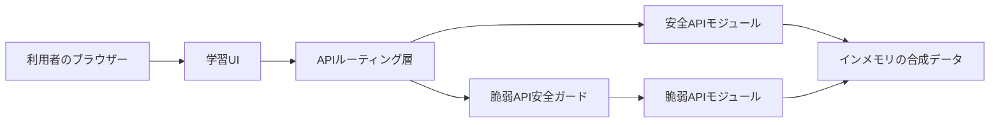
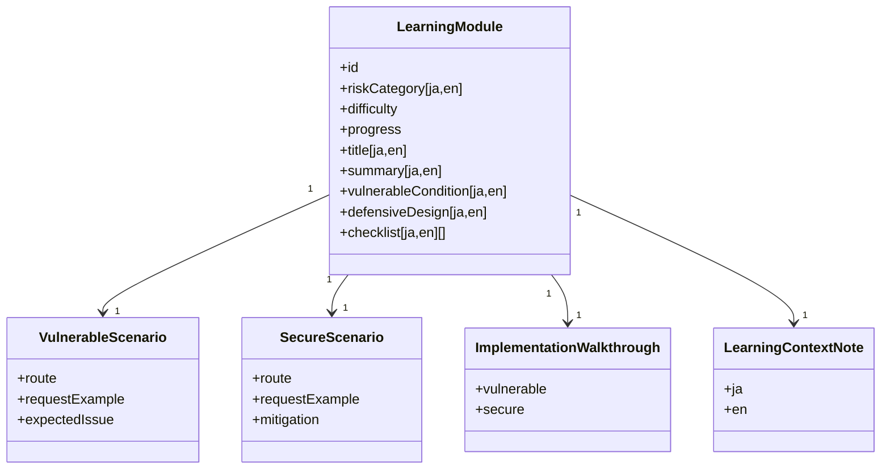
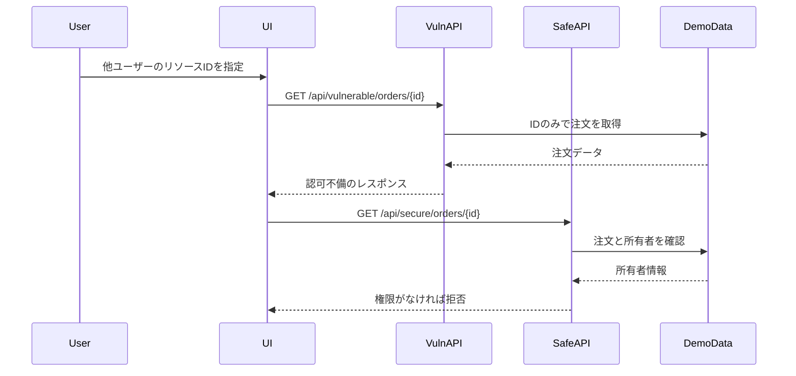
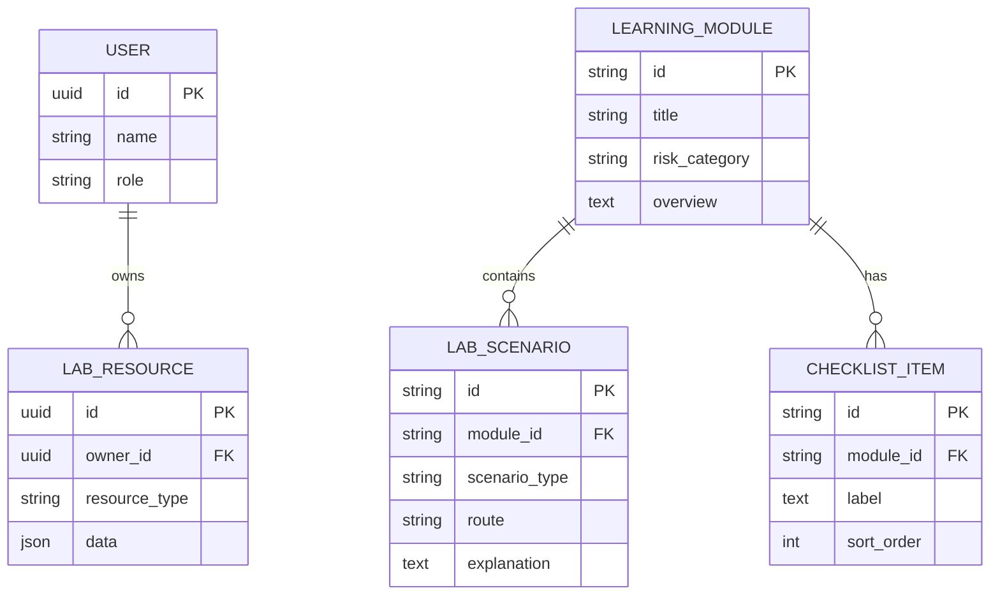
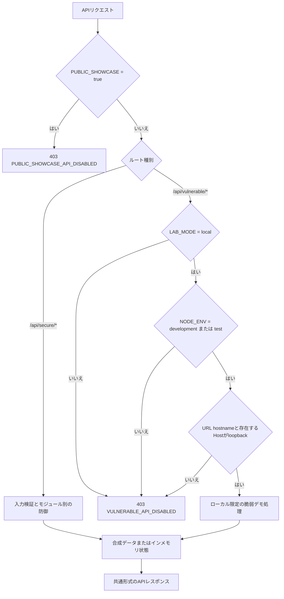
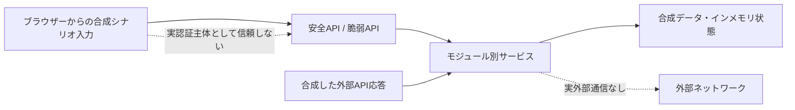
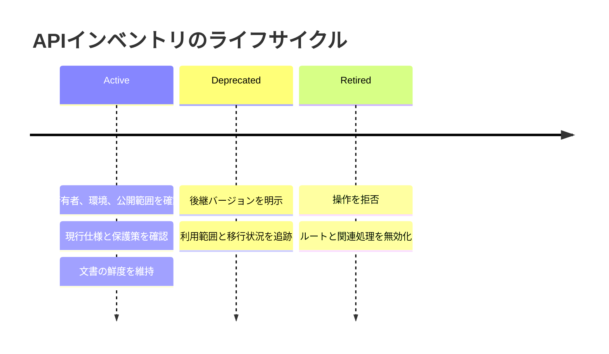
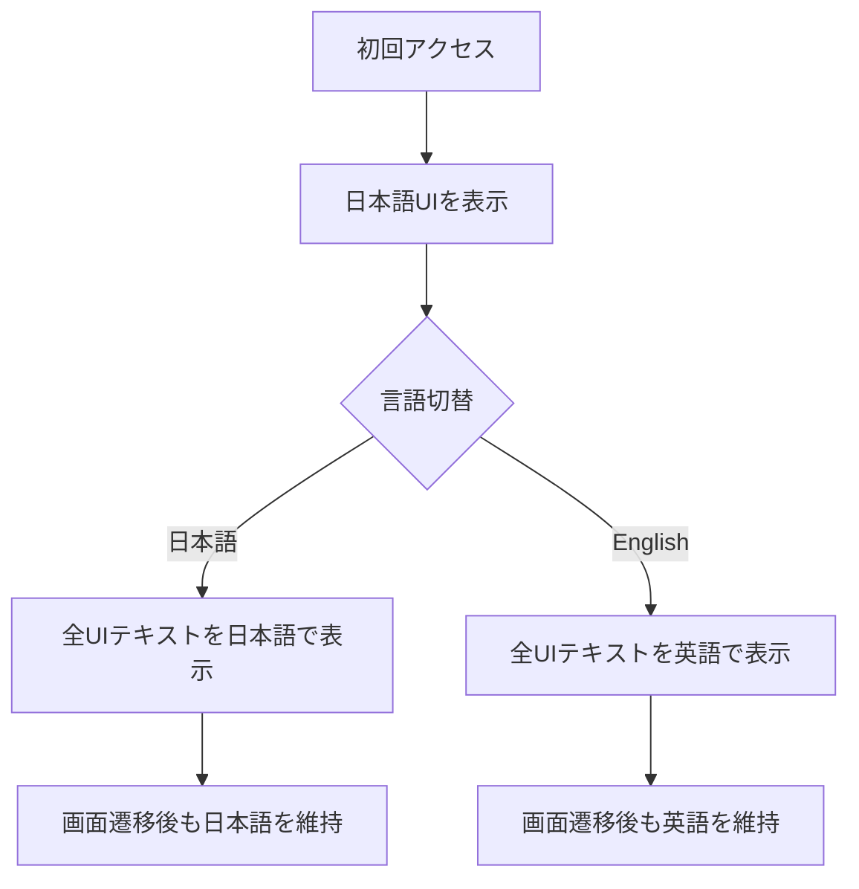

# APIセキュリティ学習・検証プラットフォーム 設計書

## 技術選定

現在の実装では、API仕様の明確化、リクエスト検証、認証・認可、レート制限、脆弱デモの隔離を重視します。使用している技術は以下のとおりです。

- フロントエンド: TypeScript + React + Next.js App Router
- バックエンド: Next.js Route Handlers
- パッケージ管理: npm と `package-lock.json`
- 入力検証: Zod
- テスト: Vitest
- Lint・フォーマット: ESLint と Prettier
- API仕様: `docs/api/openapi.json` のOpenAPI仕様
- 公開実行環境: OpenNextを使用したCloudflare Workers上の読み取り専用公開ショーケース
- データベース・ORM: 未導入。現在のデモはインメモリの状態と合成データで動作する

TypeScriptを使用する理由は、APIリクエスト、レスポンス、認可対象リソース、学習モジュールを型で管理し、脆弱な例と安全な例の違いを明確にしやすいためです。OpenAPIは、実装済みAPIの仕様と検証観点を文書化するために使用します。

## アーキテクチャ

現在のデモデータは、`src/data/` 配下の合成データとして管理します。永続化は現在の実装範囲に含めません。

## モジュール構成

## BOLA検証シーケンス

## 将来構想：永続化を導入する場合の概念データモデル（未実装）

以下は、永続化を追加する場合の概念モデルです。現在の実装では、実DBではなく合成したローカル用デモデータを使用します。

## セキュリティ設計

- 脆弱APIは `/api/vulnerable/*`、安全APIは `/api/secure/*` として明確に分離する。
- 脆弱APIは既定で無効とし、`LAB_MODE=local`、`NODE_ENV`が`development`または`test`、リクエストURLのhostnameがloopback、かつ存在する`Host`ヘッダーもloopbackを示す場合だけ有効化する。不正な`LAB_MODE`は`disabled`として扱う。開発・起動コマンドは`127.0.0.1`だけで待ち受ける。hostname検査は接続元の証明ではないため、公開転送を安全にする境界として扱わない。
- 脆弱APIを操作する画面には、ローカル限定であり外部公開してはいけないことを常に表示する。
- 安全APIでは、ユーザーID、ロール、対象リソース所有者をAPI層で検証する。
- Broken Function Level Authorization対策では、管理機能に必要な機能権限をAPI層で確認し、権限不足をdeny-by-defaultで拒否する。
- Sensitive Business Flows対策では、重要な予約・購入フローについて、フロー順序、ユーザー単位上限、在庫制約、自動化の兆候をAPI層で検証する。
- SSRF対策では、実ネットワークアクセスを行わず、許可リスト、プライベートホスト拒否、リダイレクト方針、タイムアウト方針をプレビューとして返す。
- Security Misconfiguration対策では、デバッグ情報を抑制し、実際の`Origin`ヘッダーがリクエスト先と同一オリジンであることを確認し、診断APIのキャッシュ無効化とセキュリティレスポンスヘッダーを適用する。本文の`requestedOrigin`は合成した監査シナリオ入力であり、認可判断には使用しない。
- Unsafe Consumption of APIs対策では、外部API応答を`unknown`として扱い、strictなZodスキーマ、提供元、HTTPSの完全なorigin、実ペイロードサイズ、権限フィールドを検証する。
- Improper Inventory Management対策では、APIの環境、バージョン、公開範囲、所有者、文書の更新状況、退役状態、保護策の適用状況を処理前に検証する。
- レート制限は、有限の既知デモユーザーとAPIルート単位で60秒間に3回まで適用し、4回目を429で拒否する。期限切れbucketを削除し、インメモリストアは最大100件に制限する。複数プロセス間の共有や送信元単位の制限は現在の実装範囲に含めない。
- HTMLレスポンスではMiddlewareが暗号学的に予測困難なnonceをリクエストごとに生成し、CSPリクエストヘッダーを通じてNext.jsのframework script、page script、インライン初期化script、style要素へ同じnonceを付与する。本番の`script-src`は`'strict-dynamic'`を使用し、`script-src`と`style-src`の両方で`'unsafe-inline'`を許可せず、`script-src`では`'unsafe-eval'`も許可しない。`script-src-attr`と`style-src-attr`は`'none'`とする。ヒーローアニメーション遅延、テーマの`color-scheme`、オープニング中のスクロール固定は、style属性やDOM style操作ではなく外部CSSと`data-*`状態で表現する。nonceの再利用を防ぐためHTMLを動的描画して`Cache-Control: no-store`を設定する。Next.jsのCSS URLは内容変更後も再利用される場合があるため、CSS assetは`max-age=0, must-revalidate`として古い表示を再検証させる。内容識別子付きのscriptとfontは1年間`immutable`で保持する。APIレスポンスには`default-src 'none'`を基準とするCSPと`Cache-Control: no-store`を適用する。HTMLとAPIの両方でフレーム埋め込み拒否、MIME sniffing拒否、Referrer制御を維持し、HTMLにはPermissions Policyも適用する。
- `public/_headers`では、リクエストごとのnonceを静的な方針へ含められないためCSPを定義しない。生成済み静的asset向けの基本レスポンスヘッダーとキャッシュ規則は維持し、HTMLのCSPはMiddlewareだけを正本とする。
- 公開ショーケースモードは`PUBLIC_SHOWCASE=true`で有効化する。Middlewareは安全APIを含むすべての`/api/*`リクエストをRoute Handlerへ到達する前に拒否する。UIでは日英の読み取り専用案内を維持し、`fetch`を呼び出さずに合成データによるリクエスト結果を既存の結果パネルへ読み込めるようにする。空でない値のうち明示的な`false`以外は、安全側へ倒して公開境界を有効にする。
- CIでは`LAB_MODE=disabled`と`PUBLIC_SHOWCASE=true`を強制し、依存関係とアプリケーションの検証、OpenNext Workerの1回だけのビルド、Wrangler dry run、workerdへのHTTP境界検証を順に実行する。workerd検証ではHTMLを2回取得し、nonceの一意性、全script・style要素との一致、HTMLからのstyle属性除外、本番`script-src`・`style-src`からの`'unsafe-inline'`除外、`script-src`からの`'unsafe-eval'`除外、公開API遮断を確認する。同じworkerd成果物に対するPlaywrightのデスクトップ・モバイルChromiumテストで、CSP違反、公開操作からの`/api`通信、結果表示、テーマ保持、日英切替を実ブラウザー検証する。テストはreduced-motion状態でaxeを実行し、日本語初期状態と英語・ダークテーマ・結果表示後のWCAG 2.0・2.1・2.2 A/AA違反を検査する。全テーマ横断テストはOWASP API1からAPI10までを日本語で選択してテーマ固有の合成結果を表示し、英語へ切り替えて同じ10テーマのタイトル、結果ステータス、axe違反なし、`/api`通信なしを再確認する。テーマ、言語、結果表示をTabとEnterで操作し、スクロール可能な結果本文へのフォーカスも確認する。オープニング専用テストでは通常モーションで日英の初回ダイアログ、初期フォーカス、Tab・Shift+Tabトラップ、Escape・スキップ終了、終了後のブランドフォーカス、表示済み状態の保存を確認し、reduced-motionではダイアログを省略する。検証はpush、Pull Request、手動実行、および毎週月曜12:17（日本時間）に行う。scheduleイベントではdeploy jobの条件を満たさず、Cloudflare認証情報を使用しない。npm依存関係は毎週火曜、GitHub Actionsは毎週水曜にDependabotが確認し、minor・patch更新を用途別にグループ化したPull Request、major更新を個別Pull Requestとして提示する。検証済みの`.open-next`成果物を変更せずdeploy jobへ渡し、Cloudflare認証情報は`main`へのpushで全検証が成功した後の最終deployステップだけへ公開する。デプロイはリポジトリ設定で明示的に有効化した場合だけ実行する。

- ローカル境界を検証するCIステップだけは、ラボ無効の既定値に対する明示的な例外として、一時的に`LAB_MODE=local`と`PUBLIC_SHOWCASE=false`を設定する。本番ビルドとworkerd検証では、引き続きラボを無効化して公開ショーケース境界を使用する。
- Wrangler telemetryはプロジェクト設定で無効化し、ビルド、dry run、プレビュー、デプロイのいずれでも送信しない。
- 視覚回帰テストでは、フォントの読み込み、2回の描画フレーム、文書内アニメーションの完了後に、日本語・ライトテーマの初期表示範囲、英語・ダークテーマの比較見出しと脆弱側結果パネルを取得する。取得時はアニメーションとキャレットを無効化して動きを抑える設定を要求し、OS固有のフォント描画差を考慮してPlaywrightのプロジェクト・OS別に基準画像を分離する。
- ブラウザー検証に失敗した場合は、Playwrightのスクリーンショット、差分、エラー情報、保持したtraceを、デプロイ用認証情報に触れない7日間の診断用artifactとして保存する。
- `main`ブランチではPull Requestと、GitHub Actionsが生成する`verify`チェックの成功を必須とし、マージ前に最新の`main`との同期を求め、管理者にも保護を適用する。単独管理者での運用に合わせて承認は要求せず、force pushとブランチ削除は禁止する。マージに成功すると既存のpushワークフローが起動し、デプロイ前に同じ検証を再実行する。
- 開発環境とCIではNode.js 22.13.0以降をサポートし、直接参照するNode.js型定義には対応する`@types/node` 22系を使用する。Dependabotは同型定義のminor・patch更新を引き続き提示するが、サポート対象のruntime majorを意図的に更新して検証するまではmajor更新を除外する。

### ルート分離と脆弱API安全ガード

安全APIは各モジュールの検証を通過した場合だけ合成データを処理します。脆弱APIはそれに加えて共通の安全ガードを通り、ローカル学習環境の条件を満たさない場合はデモ処理へ進みません。

ヘルスチェック、サンプルデータ、BOLA注文、認証セッション、レート制限検索、管理者招待、業務フロー予約、プロフィール更新、URL取得プレビュー、設定診断、APIインベントリ操作、外部プロフィール連携の各Route Handlerを `/api/vulnerable/*` と `/api/secure/*` に分けます。脆弱APIルートは、レスポンスを返す前に共通の安全ガードを通します。

### Cloudflare公開ショーケース

- `@opennextjs/cloudflare`でNext.jsアプリケーションを`.open-next/worker.js`へ変換し、Wranglerが`.open-next/assets`の生成済み静的assetを配信する。
- `wrangler.jsonc`で公開実行環境を`LAB_MODE=disabled`、`NODE_ENV=production`、`PUBLIC_SHOWCASE=true`に固定する。
- GitHub ActionsではCloudflare認証情報をリポジトリのSecretsで管理し、Account IDやAPI Tokenを追跡対象ファイルへ記録しない。
- 公開サイトでは学習コンテンツ、リクエスト例、合成レスポンス例、設計差分、実装フローだけを表示し、安全APIと脆弱APIのライブ実行は提供しない。
- `src/data/showcase-results.ts`で全学習テーマの安定した合成レスポンス形式を管理する。公開ショーケース案内と「リクエスト結果を表示」操作は脆弱側・安全側のAPI例の後に配置する。操作時は合成データをクライアント状態へコピーしてローカルデモと同じ結果パネルを再利用し、Route Handlerやサービス関数を呼び出さない。

## API基盤

- 共通APIレスポンスは `src/lib/api-response.ts` で定義し、成功時は `{ ok, data, meta }`、エラー時は `{ ok, error, meta }` を返す。Route Handlerとルート到達前のMiddleware応答に対するAPIセキュリティヘッダーの正本とし、キャッシュ禁止、厳格なCSP、クロスオリジン保護、Permissions Policy、Referrer・MIME sniffing制御、フレーム埋め込み拒否を適用し、CORS許可ヘッダーを除去する。
- 共通リクエスト検証は `src/lib/request-validation.ts` で定義し、JSON本文に`application/json`と任意の`charset=utf-8`だけを許可する。正しいUTF-8とJSONを要求し、宣言サイズと実読込サイズを16 KiB以下に制限してからZodスキーマを使用する。不正UTF-8・JSON、過大本文、非対応Content-Typeは統一した400、413、415エラーへ変換する。テストでは不正なマルチバイト列を文字列変換前のRequest本文へ直接渡し、UTF-8拒否を確認する。単一値クエリの重複は配列化してスキーマ検証で拒否する。
- ローカル用のサンプルユーザーとサンプルリソースは `src/data/lab-samples.ts` で定義する。合成したデモ用IDだけを使用し、実在する個人情報、ログ、認証情報、トークンは含めない。
- `src/lib/lab-sample-service.ts` は、永続化を導入する前の段階でデータベース依存を増やさず、APIモジュールへフィルタ済みサンプルデータを提供する。
- `docs/api/openapi.json` では、実装済みルート、安全/脆弱タグの分離、共通の成功/エラーレスポンス形式、脆弱ルートのローカル限定動作を記述する。

### デモ用信頼境界

このラボの`userId`、`actorUserId`、デモトークンIDは、各認可・認証パターンを比較するための有限な合成シナリオ入力です。実在する利用者を認証するセッションやBearer tokenではなく、安全APIの各例もそのモジュールが扱う防御観点に限定されています。実サービスへ適用する場合は、サーバー側で検証したセッションまたは署名済みトークンから主体を確定し、クライアント指定のIDを認証主体として使用してはいけません。

インメモリのレート制限、予約数、在庫、試行回数は単一プロセスのローカルデモ向けです。複数インスタンスや永続的な運用では、原子的な共有ストア、信頼できる送信元識別、監査ログ、鍵管理、TLS終端を別途実装する必要があります。

## BOLAモジュール設計

- 脆弱なBOLAルート `/api/vulnerable/orders/{orderId}` は、ローカル限定の安全ガードを通過した後、ローカル用デモ注文をIDだけで取得する。
- 安全なBOLAルート `/api/secure/orders/{orderId}` は `userId` を必須とし、指定された注文がそのデモユーザーに属するかを検証する。
- 比較UIでは、所有者ではないユーザーとして `order-demo-002` を実行し、脆弱ルートでは注文が返り、安全ルートでは `403 FORBIDDEN` が返ることを確認できる。
- BOLA実装では合成したデモユーザーとデモリソースのみを使用し、実在するアカウント、注文、ログ、トークンは使用しない。

## 認証モジュール設計

- 脆弱な認証ルート `/api/vulnerable/auth/session` は、ローカル限定の安全ガードを通過した後、既知のデモトークンIDだけを見てセッションを受け入れる。
- 安全な認証ルート `/api/secure/auth/session` は、デモトークンの署名状態、期限、失効状態、必要な権限を確認してからセッションを受け入れる。
- 合成トークンは拒否条件を独立させる。`demo-token-invalid-signature-admin`は署名だけが不正、`demo-token-expired-admin`は署名が有効で期限切れ、`demo-token-revoked-admin`は署名が有効で有効期限内だが失効済みとする。比較UIでは期限切れトークンを使用し、脆弱ルートでは受け入れられ、安全ルートでは`401 UNAUTHORIZED`が返ることを確認できる。
- 認証モジュールでは合成したトークンIDとメタデータのみを使用し、実トークン、署名鍵、秘密情報、認証情報、実セッションは含めない。

## レート制限・Mass Assignment・SSRFモジュール設計

- 脆弱なレート制限ルート `/api/vulnerable/rate-limit/search` は、繰り返しリクエストに制限を適用しない。安全なルート `/api/secure/rate-limit/search` は、ルートとデモユーザーをキーに、60秒のbucket内で3回まで許可し、4回目は `429 RATE_LIMITED` を返す。
- 脆弱なMass Assignmentルート `/api/vulnerable/profile` は、`ownerId` や `role` など権限が必要な項目も含め、受け入れたプロパティをそのまま適用する。安全なルート `/api/secure/profile` は、通常更新で許可するプロフィール項目を許可リストで制限し、権限項目や所有者項目が含まれる場合は403で拒否する。
- 脆弱なSSRFルート `/api/vulnerable/fetch-url` は、任意URLを受け入れる例として動作する。ただし、実際の外部ネットワークアクセスは行わない。安全なルート `/api/secure/fetch-url` はHTTPSを必須とし、プライベートホストを拒否し、`api.example.test` のみを許可するプレビューを返す。
- SSRFデモでは実際の外部ネットワークアクセスを行わず、脆弱APIと安全APIのどちらもプレビュー用メタデータだけを返す。サービスとRoute Handlerのテストでは、HTTPと許可リスト外ホストの拒否、リダイレクトの手動処理、2000 msのタイムアウト方針を確認し、`fetch`を呼ぶと即座に失敗するモックへ置き換えて外部通信を開始させない。

## Broken Function Level Authorizationモジュール設計

- 脆弱な管理者招待ルート `/api/vulnerable/admin/invitations` は、ローカル限定の安全ガードを通過した後、機能単位の権限を確認せずに合成した管理者招待リクエストを受け入れる。
- 安全な管理者招待ルート `/api/secure/admin/invitations` は、招待プレビューを返す前に、実行者のロールと `admin:invitations:create` 権限を検証する。
- 比較UIでは、管理権限を持たない学習者 `user-demo-alice` としてリクエストを実行する。脆弱ルートでは受け入れられ、安全ルートでは `403 FORBIDDEN` が返ることを確認できる。
- 機能単位認可デモでは合成した実行者と招待メタデータのみを使用し、実メール送信、実アカウント作成、実在する個人情報、外部サービス連携は行わない。

## Sensitive Business Flowsモジュール設計

- 脆弱な業務フロールート `/api/vulnerable/business-flow/reservations` は、ローカル限定の安全ガードを通過した後、限定商品の予約リクエストをフロー順序やユーザー単位上限を確認せずに受け入れる。
- 安全な業務フロールート `/api/secure/business-flow/reservations` は、各試行でユーザー・商品単位の自動化カウンターを増加させ、予約前にフロー順序、累積数量上限、在庫制約を検証する。成功時だけ残在庫と累積予約数を更新し、脆弱側のプレビューはこの状態を更新しない。
- 比較UIでは、`direct-checkout` で `product-demo-001` を4件予約しようとするリクエストを実行する。脆弱ルートでは受け入れられ、安全ルートでは `403 FORBIDDEN` が返ることを確認できる。
- 業務フローデモでは合成した限定商品データだけを使用し、実在する商品、注文、決済、個人情報、外部サービス連携は使用しない。

## Security Misconfigurationモジュール設計

- 脆弱な設定診断ルート `/api/vulnerable/config/diagnostics` は、ローカル限定の安全ガードを通過した後、合成したデバッグ設定、合成スタックトレース、過度に広いCORSレスポンスメタデータを返す。
- 安全な設定診断ルート `/api/secure/config/diagnostics` は、実際の`Origin`ヘッダーが存在する場合にリクエストURLのoriginとの完全一致を要求し、cross-originアクセスは許可しない。`Origin`がない非ブラウザークライアント等は受け付ける。`Access-Control-Allow-Origin`は返さず、デバッグ詳細を抑制し、キャッシュを無効化してセキュリティレスポンスヘッダーを適用する。
- 比較UIでは、本文の`requestedOrigin`に`https://untrusted.example`を指定する。これは合成した監査シナリオ入力であり、脆弱ルートはデバッグ情報と過度に広いCORS方針の合成メタデータを返す。安全ルートは実際の`Origin`ヘッダーをリクエスト先と比較し、同一オリジンなら公開可能な診断情報だけを返し、異なる場合は`403 FORBIDDEN`で拒否する。
- Security Misconfigurationデモでは合成した診断メタデータだけを使用し、実設定、秘密情報、個人情報、内部ログ、実スタックトレースは公開しない。

## Unsafe Consumption of APIsモジュール設計

- 脆弱な外部プロフィール連携ルート `/api/vulnerable/third-party/profile-import` は、ローカル限定の安全ガードを通過した後、合成した外部API応答のリダイレクト先や権限フィールドを検証せずに取り込む。
- 安全な外部プロフィール連携ルート `/api/secure/third-party/profile-import` は、提供元、TLS前提、リダイレクト許可先、応答サイズ、応答スキーマ、権限フィールドを検証し、信頼できない応答を拒否する。
- 比較UIでは、`partner-response-redirect-admin` を取り込もうとするリクエストを実行する。脆弱ルートでは管理者ロールと許可されていないリダイレクト先が受け入れられ、安全ルートでは `403 FORBIDDEN` が返ることを確認できる。
- 外部API応答デモでは実際の外部API通信を行わず、合成した外部応答だけを使用する。実在する提携先、個人情報、認証情報、外部サービス連携は使用しない。

## Improper Inventory Managementモジュール設計

- 脆弱なAPIインベントリルート `/api/vulnerable/inventory/operations` は、ローカル限定の安全ガードを通過した後、退役済みの旧API操作をライフサイクルや公開範囲の確認なしに処理する。
- 安全なAPIインベントリルート `/api/secure/inventory/operations` は、APIの環境、バージョン、公開範囲、所有者、文書の鮮度、退役状態、保護策の適用状況を確認し、退役済みや管理外の操作を拒否する。
- 比較UIでは、`legacy-token-reset-v1` を `production` で実行しようとするリクエストを使用する。脆弱ルートではプレビューが作成され、安全ルートでは `403 FORBIDDEN` が返ることを確認できる。
- APIインベントリデモでは合成したインベントリと操作結果だけを使用し、実トークン発行、通知送信、実在する利用者データ、実ログ、外部サービス連携は行わない。

次の図は、APIインベントリで管理する概念的なライフサイクルを示します。実際の日程や公開計画ではなく、安全APIが操作前に確認する状態と管理観点を表します。

## 多言語UI設計

初期表示は日本語とし、すべての画面で共通ヘッダーまたは共通ナビゲーション内に言語切替を配置します。言語設定はアプリケーション全体で共有し、画面遷移後も選択状態を維持します。

- 学習モジュール名、警告、リクエスト説明、レスポンス説明、防御策、確認項目を翻訳対象に含める。
- 日本語設定では日本語、英語設定では英語に統一する。
- API、BOLA、SSRF、Mass Assignment、OWASPなどの一般的な技術用語は日本語設定でも英語表記を許容する。
- UI文言は `src/lib/i18n.ts`、学習モジュールの内容は `src/data/learning-modules.ts` で管理する。
- 共通ヘッダーでは、言語切替とラベル付きの太陽・月アイコンのテーマ切替ボタンを一つの操作領域にまとめる。選択したテーマ値（`light`または`dark`）をルートの`data-theme`属性へ適用し、可能であればローカルストレージへ保存する。ハイドレーション前の初期化スクリプトでライトテーマが一瞬表示されることを防ぎ、Web Storageへのアクセスが拒否された場合もメモリ上の選択で操作を継続できるようにする。

## セキュリティ検証設計

- `src/lib/security-verification.test.ts` は、公開環境に相当する設定ですべての脆弱APIが `403 VULNERABLE_API_DISABLED` を返すことを横断的に確認する。
- 同テストでは、安全APIがBOLA、認証不備、レート制限不足、機能単位認可不備、業務フロー悪用、Mass Assignment、SSRF、セキュリティ設定不備、旧API管理不備、外部API応答の過信を再現しないことを確認する。
- `src/lib/openapi.test.ts` は、すべての脆弱API操作にローカル限定の説明と公開環境相当での無効化レスポンスが記述されていることを確認する。
- `src/test-utils/route-inventory.ts`はRoute Handlerの実ファイル、エクスポートされたHTTPメソッド、動的パスパラメーターを検出する。ルート一覧テストでは安全・脆弱API操作の対応、脆弱API操作ごとのローカル限定ガード呼び出し、OpenAPIの完全な収録、公開環境相当の実行検証一覧への登録を必須とする。
- ルート一覧ではTypeScriptの構文木を使用し、関数、変数、名前付き再exportによるHTTPメソッドを検出する。各POST・PATCH操作が共通JSON解析処理を呼び出すことも必須とする。動的なRoute Handler検証一覧から、検出したすべての本文付き操作へ非対応Content-Type、過大な宣言サイズ、上限ちょうどの本文、過大な実本文を送信し、共通のHTTPステータス、エラーコード、ルートメタデータ、`no-store`、MIME sniffing防止を確認する。
- 意味的に有効な成功fixture一覧から全24 API操作を実行し、完全な共通APIセキュリティヘッダー、JSON応答形式、ルートメタデータ、CORS許可ヘッダーがないことを必須とする。既存のリクエスト境界一覧と公開環境相当の脆弱ルート一覧でも、413、415、403応答に同じ契約を適用する。ローカルNext.js境界スクリプトでは安全・脆弱healthの200応答と`Host`拒否を検証し、公開workerdスクリプトではルート到達前の全API遮断ケースと`X-Powered-By`がないことを確認する。
- `scripts/verify-repository-safety.mjs`は依存関係のインストール前にGit追跡対象のパスとファイル内容を検査する。`.env.example`だけを許可し、開発者専用文書、環境変数・Worker変数ファイル、鍵・証明書、ログ、ローカルDBを拒否するほか、秘密情報の内容を表示せずに秘密鍵ヘッダーを検出する。
- UI文言リソースは、日英のキー構造が揃っていることをテストし、共通画面ラベルの言語混在を避ける。
- `src/lib/public-showcase.test.ts`で両API種別のRoute Handler到達前停止を確認する。コンポーネントテストで通信なしのリクエスト結果表示を確認し、静的データテストで全テーマを検証する。OpenNext build、Wrangler dry run、CIのworkerd HTTP確認で、デプロイへ渡す同一成果物と実行時境界を検証する。
- ローカルモードの`HomePage`コンポーネントテストでは、全学習テーマを選択してライブデモのHTTPメソッド、URL、JSON本文、レート制限用の安全API連続呼び出しを検証する。通信失敗とJSON解析失敗を別々に発生させ、実行中状態の解除、操作の再有効化、日本語または英語のエラー通知も確認する。
- `scripts/verify-local-lab-boundary.mjs`は、利用可能なポートで実際のNext.js開発サーバーをローカルモードとして起動する。保護ヘッダー付きの安全・脆弱health応答が成功すること、ループバック以外の`Host`ヘッダーが保護ヘッダー付きの無効化エラーを返すこと、利用可能なすべてのループバック以外のIPv4インターフェースからサーバーポートへTCP接続できないことを確認する。通常完了時、検証失敗時、処理可能な終了シグナル受信時に子プロセスを停止してNext.jsの生成型参照を復元し、ローカルパスや環境情報を公開しないようにサーバー出力を破棄する。

## 画面設計

- 学習テーマ一覧: 各モジュールのリスクカテゴリ、難易度、進捗、概要、選択状態を表示する。
- 学習詳細: 選択したモジュールの概要、脆弱性が生じる条件、防御設計を表示する。
- 比較ビュー: 脆弱APIと安全APIのルート、リクエスト、レスポンス、設計上の説明、実装フローを並べて表示する。実装フローでは、APIプログラム全体の流れを表示し、`/api/vulnerable/*` の問題箇所を赤、`/api/secure/*` の改善箇所を青で示す。
- チェックリスト: 選択したモジュールの実装時に確認すべき防御観点を表示する。現在、進捗は保存しない。
- 脆弱APIの比較領域には、ローカル限定かつ外部公開禁止であることを常に表示する。
- 言語設定、テーマ設定、オープニング表示済み状態のWeb Storageへの保存は任意とし、アクセスが拒否されても既定値を使って通常画面の表示を継続する。
- APIデモの通信またはJSON読込に失敗した場合は、実行状態を必ず解除して日英のエラーを通知する。
