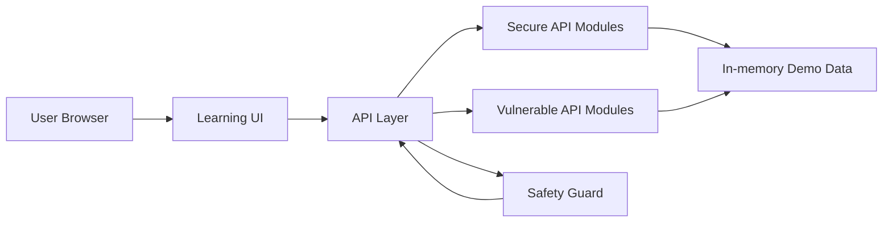
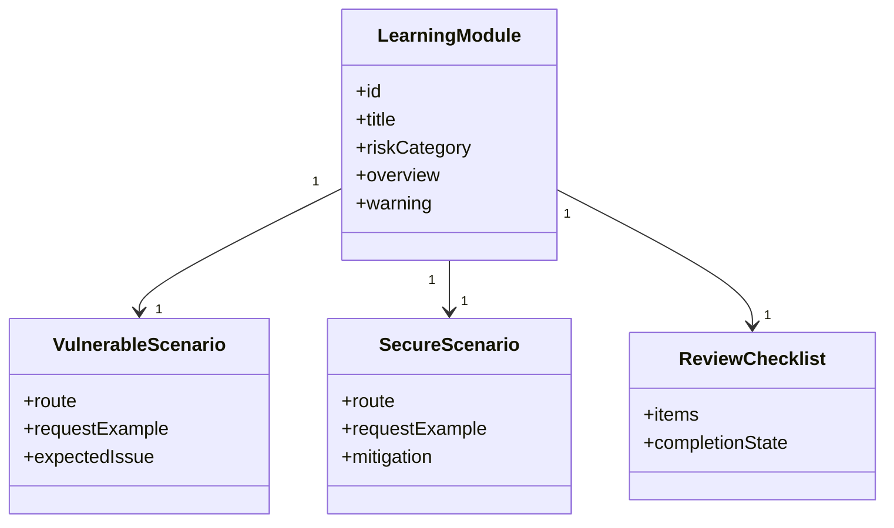
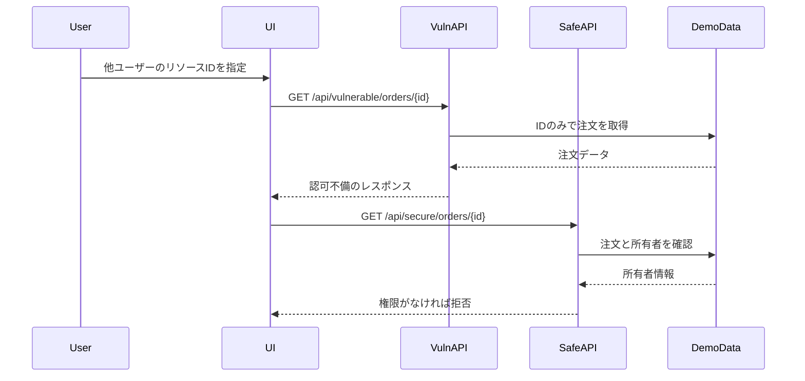
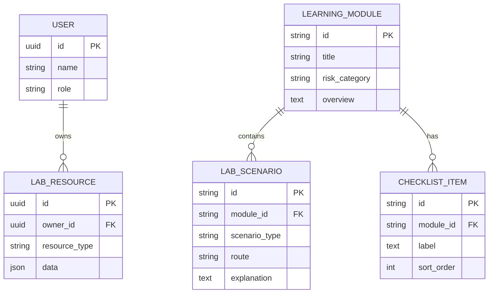
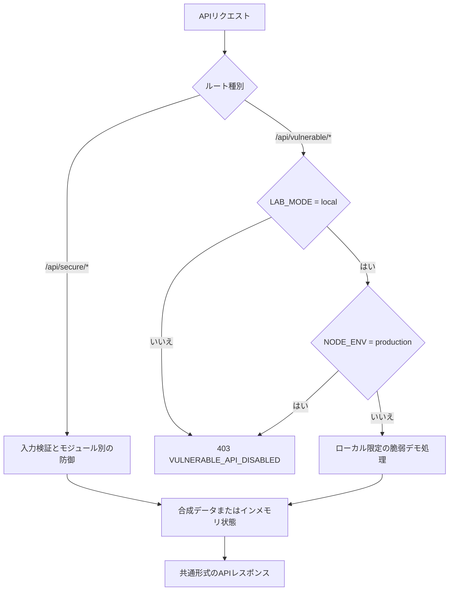
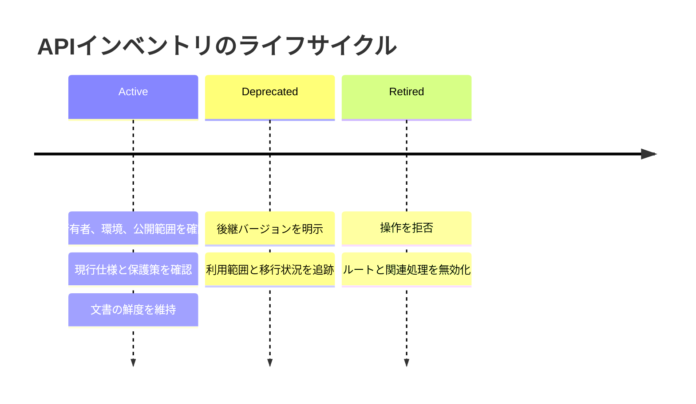
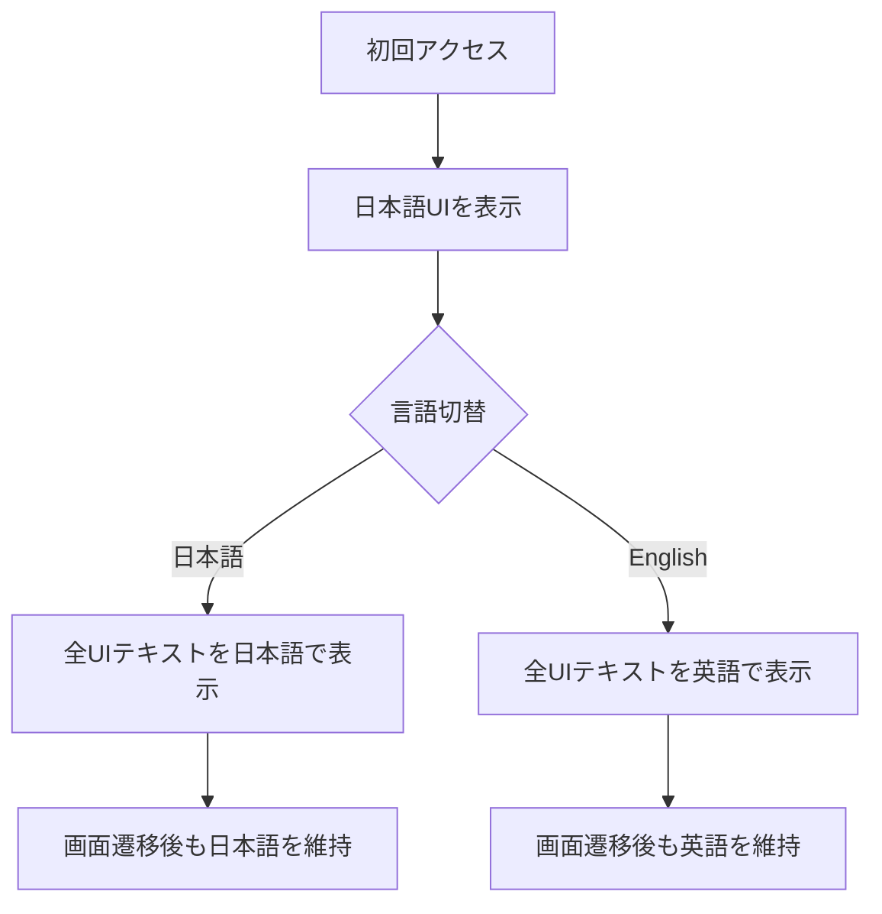

# APIセキュリティ学習・検証プラットフォーム 設計書

## 技術選定

現在の実装では、API仕様の明確化、リクエスト検証、認証・認可、レート制限、脆弱デモの隔離を重視します。使用している技術は以下のとおりです。

- Frontend: TypeScript + React + Next.js App Router
- Backend: Next.js Route Handlers
- Package manager: npm と `package-lock.json`
- Validation: Zod
- Testing: Vitest
- Linting and formatting: ESLint と Prettier
- API Documentation: `docs/api/openapi.json` のOpenAPI仕様
- Database and ORM: 未導入。現在のデモはインメモリの状態と合成データで動作する

TypeScriptを使用する理由は、APIリクエスト、レスポンス、認可対象リソース、学習モジュールを型で管理し、脆弱な例と安全な例の違いを明確にしやすいためです。OpenAPIは、実装済みAPIの仕様と検証観点を文書化するために使用します。

## アーキテクチャ

現在のデモデータは、`src/data/` 配下の合成データとして管理します。永続化は現在の実装範囲に含めません。

## モジュール構成

## BOLA検証シーケンス

## 将来のデータモデル

以下は、永続化を追加する場合の概念モデルです。現在の実装では、実DBではなく合成したローカル用デモデータを使用します。

## セキュリティ設計

- 脆弱APIは `/api/vulnerable/*`、安全APIは `/api/secure/*` として明確に分離する。
- 脆弱APIでは `LAB_MODE=local` を必須とし、`NODE_ENV=production` では無効化する。
- 脆弱APIを操作する画面には、ローカル限定であり外部公開してはいけないことを常に表示する。
- 安全APIでは、ユーザーID、ロール、対象リソース所有者をAPI層で検証する。
- Broken Function Level Authorization対策では、管理機能に必要な機能権限をAPI層で確認し、権限不足をdeny-by-defaultで拒否する。
- Sensitive Business Flows対策では、重要な予約・購入フローについて、フロー順序、ユーザー単位上限、在庫制約、自動化の兆候をAPI層で検証する。
- SSRF対策では、実ネットワークアクセスを行わず、許可リスト、プライベートホスト拒否、リダイレクト方針、タイムアウト方針をプレビューとして返す。
- Security Misconfiguration対策では、デバッグ情報を抑制し、Origin許可リスト、診断APIのキャッシュ無効化、セキュリティレスポンスヘッダーを適用する。
- Unsafe Consumption of APIs対策では、外部API応答を信頼境界外の入力として扱い、提供元、TLS前提、リダイレクト許可先、応答サイズ、スキーマ、権限フィールドを検証する。
- Improper Inventory Management対策では、APIの環境、バージョン、公開範囲、所有者、文書の鮮度、退役状態、保護策の適用状況を処理前に検証する。
- レート制限は、現在はデモユーザーとAPIルート単位で適用する。送信元単位の制限は現在の実装範囲に含めない。

### ルート分離と脆弱API安全ガード

安全APIは各モジュールの検証を通過した場合だけ合成データを処理します。脆弱APIはそれに加えて共通の安全ガードを通り、ローカル学習環境の条件を満たさない場合はデモ処理へ進みません。

ヘルスチェック、サンプルデータ、BOLA注文、認証セッション、レート制限検索、管理者招待、業務フロー予約、プロフィール更新、URL取得プレビュー、設定診断、APIインベントリ操作、外部プロフィール連携の各Route Handlerを `/api/vulnerable/*` と `/api/secure/*` に分けます。脆弱APIルートは、レスポンスを返す前に共通の安全ガードを通します。

## API基盤

- 共通APIレスポンスは `src/lib/api-response.ts` で定義し、成功時は `{ ok, data, meta }`、エラー時は `{ ok, error, meta }` を返す。
- 共通リクエスト検証は `src/lib/request-validation.ts` で定義し、`src/lib/api-schemas.ts` のZodスキーマを使用する。
- ローカル用のサンプルユーザーとサンプルリソースは `src/data/lab-samples.ts` で定義する。合成したデモ用IDだけを使用し、実在する個人情報、ログ、認証情報、トークンは含めない。
- `src/lib/lab-sample-service.ts` は、永続化を導入する前の段階でデータベース依存を増やさず、APIモジュールへフィルタ済みサンプルデータを提供する。
- `docs/api/openapi.json` では、実装済みルート、安全/脆弱タグの分離、共通の成功/エラーレスポンス形式、脆弱ルートのローカル限定動作を記述する。

## BOLAモジュール設計

- 脆弱なBOLAルート `/api/vulnerable/orders/{orderId}` は、ローカル限定の安全ガードを通過した後、ローカル用デモ注文をIDだけで取得する。
- 安全なBOLAルート `/api/secure/orders/{orderId}` は `userId` を必須とし、指定された注文がそのデモユーザーに属するかを検証する。
- 比較UIでは、所有者ではないユーザーとして `order-demo-002` を実行し、脆弱ルートでは注文が返り、安全ルートでは `403 FORBIDDEN` が返ることを確認できる。
- BOLA実装では合成したデモユーザーとデモリソースのみを使用し、実在するアカウント、注文、ログ、トークンは使用しない。

## 認証モジュール設計

- 脆弱な認証ルート `/api/vulnerable/auth/session` は、ローカル限定の安全ガードを通過した後、既知のデモトークンIDだけを見てセッションを受け入れる。
- 安全な認証ルート `/api/secure/auth/session` は、デモトークンの署名状態、期限、失効状態、必要な権限を確認してからセッションを受け入れる。
- 比較UIでは、署名状態が不正、期限切れ、失効済みの `demo-token-expired-admin` を使用する。脆弱ルートでは受け入れられ、安全ルートでは `401 UNAUTHORIZED` が返ることを確認できる。
- 認証モジュールでは合成したトークンIDとメタデータのみを使用し、実トークン、署名鍵、秘密情報、認証情報、実セッションは含めない。

## レート制限・Mass Assignment・SSRFモジュール設計

- 脆弱なレート制限ルート `/api/vulnerable/rate-limit/search` は、繰り返しリクエストに制限を適用しない。安全なルート `/api/secure/rate-limit/search` は、ルートとデモユーザーをキーにしたインメモリの制限を適用し、デモ用の上限を超えた場合は `429 RATE_LIMITED` を返す。
- 脆弱なMass Assignmentルート `/api/vulnerable/profile` は、`ownerId` や `role` など権限が必要な項目も含め、受け入れたプロパティをそのまま適用する。安全なルート `/api/secure/profile` は、通常更新で許可するプロフィール項目を許可リストで制限し、権限項目や所有者項目が含まれる場合は403で拒否する。
- 脆弱なSSRFルート `/api/vulnerable/fetch-url` は、任意URLを受け入れる例として動作する。ただし、実際の外部ネットワークアクセスは行わない。安全なルート `/api/secure/fetch-url` はHTTPSを必須とし、プライベートホストを拒否し、`api.example.test` のみを許可するプレビューを返す。
- SSRFデモでは実際の外部ネットワークアクセスを行わず、脆弱APIと安全APIのどちらもプレビュー用メタデータだけを返す。

## Broken Function Level Authorizationモジュール設計

- 脆弱な管理者招待ルート `/api/vulnerable/admin/invitations` は、ローカル限定の安全ガードを通過した後、機能単位の権限を確認せずに合成した管理者招待リクエストを受け入れる。
- 安全な管理者招待ルート `/api/secure/admin/invitations` は、招待プレビューを返す前に、実行者のロールと `admin:invitations:create` 権限を検証する。
- 比較UIでは、管理権限を持たない学習者 `user-demo-alice` としてリクエストを実行する。脆弱ルートでは受け入れられ、安全ルートでは `403 FORBIDDEN` が返ることを確認できる。
- 機能単位認可デモでは合成した実行者と招待メタデータのみを使用し、実メール送信、実アカウント作成、実在する個人情報、外部サービス連携は行わない。

## Sensitive Business Flowsモジュール設計

- 脆弱な業務フロールート `/api/vulnerable/business-flow/reservations` は、ローカル限定の安全ガードを通過した後、限定商品の予約リクエストをフロー順序やユーザー単位上限を確認せずに受け入れる。
- 安全な業務フロールート `/api/secure/business-flow/reservations` は、予約前にフロー順序、ユーザー単位の数量上限、在庫制約、自動化悪用の観点を検証する。
- 比較UIでは、`direct-checkout` で `product-demo-001` を4件予約しようとするリクエストを実行する。脆弱ルートでは受け入れられ、安全ルートでは `403 FORBIDDEN` が返ることを確認できる。
- 業務フローデモでは合成した限定商品データだけを使用し、実在する商品、注文、決済、個人情報、外部サービス連携は使用しない。

## Security Misconfigurationモジュール設計

- 脆弱な設定診断ルート `/api/vulnerable/config/diagnostics` は、ローカル限定の安全ガードを通過した後、合成したデバッグ設定、合成スタックトレース、過度に広いCORSレスポンスメタデータを返す。
- 安全な設定診断ルート `/api/secure/config/diagnostics` は、リクエストされたOriginを検証し、デバッグ詳細を抑制し、キャッシュを無効化し、`X-Content-Type-Options`、`Content-Security-Policy`、`Referrer-Policy` などのセキュリティレスポンスヘッダーを適用する。
- 比較UIでは、リクエストOriginとして `https://untrusted.example` を送信する。脆弱ルートではワイルドカードCORSメタデータとともに受け入れられ、安全ルートでは `403 FORBIDDEN` が返ることを確認できる。
- Security Misconfigurationデモでは合成した診断メタデータだけを使用し、実設定、秘密情報、個人情報、内部ログ、実スタックトレースは公開しない。

## Unsafe Consumption of APIsモジュール設計

- 脆弱な外部プロフィール連携ルート `/api/vulnerable/third-party/profile-import` は、ローカル限定の安全ガードを通過した後、合成した外部API応答のリダイレクト先や権限フィールドを検証せずに取り込む。
- 安全な外部プロフィール連携ルート `/api/secure/third-party/profile-import` は、提供元、TLS前提、リダイレクト許可先、応答サイズ、応答スキーマ、権限フィールドを検証し、信頼できない応答を拒否する。
- 比較UIでは、`partner-response-redirect-admin` を取り込もうとするリクエストを実行する。脆弱ルートではadminロールと許可されていないリダイレクト先が受け入れられ、安全ルートでは `403 FORBIDDEN` が返ることを確認できる。
- 外部API応答デモでは実際の外部API通信を行わず、合成した外部応答だけを使用する。実在する提携先、個人情報、認証情報、外部サービス連携は使用しない。

## Improper Inventory Managementモジュール設計

- 脆弱なAPIインベントリルート `/api/vulnerable/inventory/operations` は、ローカル限定の安全ガードを通過した後、退役済みの旧API操作をライフサイクルや公開範囲の確認なしに処理する。
- 安全なAPIインベントリルート `/api/secure/inventory/operations` は、APIの環境、バージョン、公開範囲、所有者、文書の鮮度、退役状態、保護策の適用状況を確認し、退役済みや管理外の操作を拒否する。
- 比較UIでは、`legacy-token-reset-v1` を `production` で実行しようとするリクエストを使用する。脆弱ルートではプレビューが作成され、安全ルートでは `403 FORBIDDEN` が返ることを確認できる。
- APIインベントリデモでは合成したインベントリと操作結果だけを使用し、実トークン発行、通知送信、実在する利用者データ、実ログ、外部サービス連携は行わない。

次の図は、APIインベントリで管理する概念的なライフサイクルを示します。実際の日程や公開計画ではなく、安全APIが操作前に確認する状態と管理観点を表します。

## 多言語UI設計

初期表示は日本語とし、すべての画面で共通ヘッダーまたは共通ナビゲーション内に言語切替を配置します。言語設定はアプリケーション全体で共有し、画面遷移後も選択状態を維持します。

- 学習モジュール名、警告、リクエスト説明、レスポンス説明、防御策、確認項目を翻訳対象に含める。
- 日本語設定では日本語、英語設定では英語に統一する。
- API、BOLA、SSRF、Mass Assignment、OWASPなどの一般的な技術用語は日本語設定でも英語表記を許容する。
- UI文言は `src/lib/i18n.ts`、学習モジュールの内容は `src/data/learning-modules.ts` で管理する。

## セキュリティ検証設計

- `src/lib/security-verification.test.ts` は、公開環境に相当する設定ですべての脆弱APIが `403 VULNERABLE_API_DISABLED` を返すことを横断的に確認する。
- 同テストでは、安全APIがBOLA、認証不備、レート制限不足、機能単位認可不備、業務フロー悪用、Mass Assignment、SSRF、セキュリティ設定不備、旧API管理不備、外部API応答の過信を再現しないことを確認する。
- `src/lib/openapi.test.ts` は、すべての脆弱API操作にローカル限定の説明と公開環境相当での無効化レスポンスが記述されていることを確認する。
- UI文言リソースは、日英のキー構造が揃っていることをテストし、共通画面ラベルの言語混在を避ける。

## 画面設計

- 学習テーマ一覧: 各モジュールのリスクカテゴリ、難易度、進捗、概要、選択状態を表示する。
- 学習詳細: 選択したモジュールの概要、脆弱性が生じる条件、防御設計を表示する。
- 比較ビュー: 脆弱APIと安全APIのルート、リクエスト、レスポンス、設計上の説明、実装フローを並べて表示する。実装フローでは、APIプログラム全体の流れを表示し、`/api/vulnerable/*` の問題箇所を赤、`/api/secure/*` の改善箇所を青で示す。
- チェックリスト: 選択したモジュールの実装時に確認すべき防御観点を表示する。現在、進捗は保存しない。
- 脆弱APIの比較領域には、ローカル限定かつ外部公開禁止であることを常に表示する。
