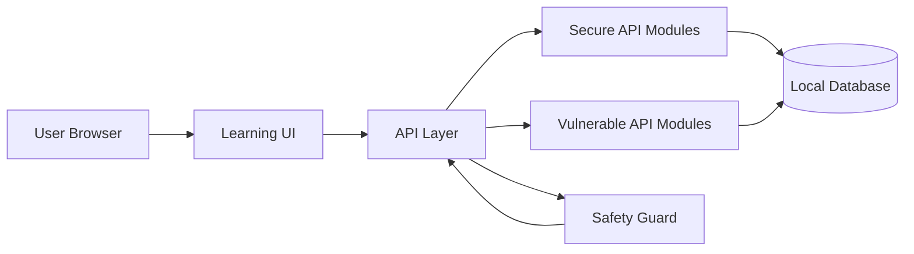
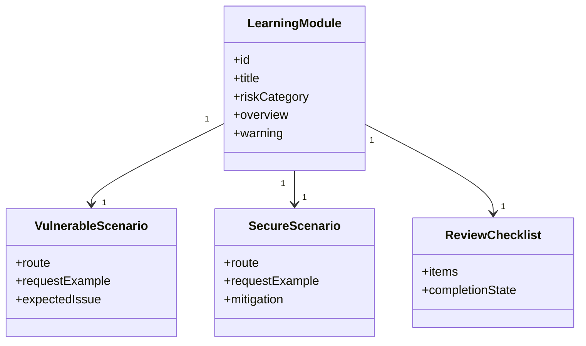
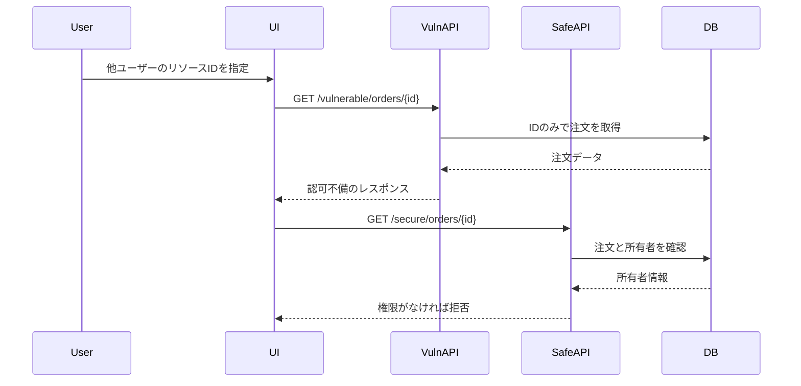
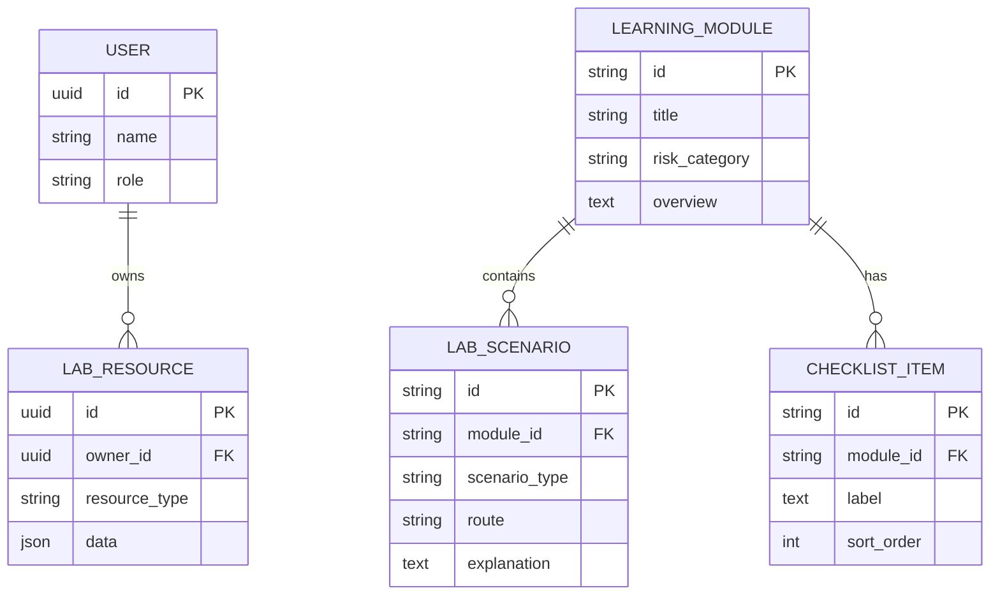
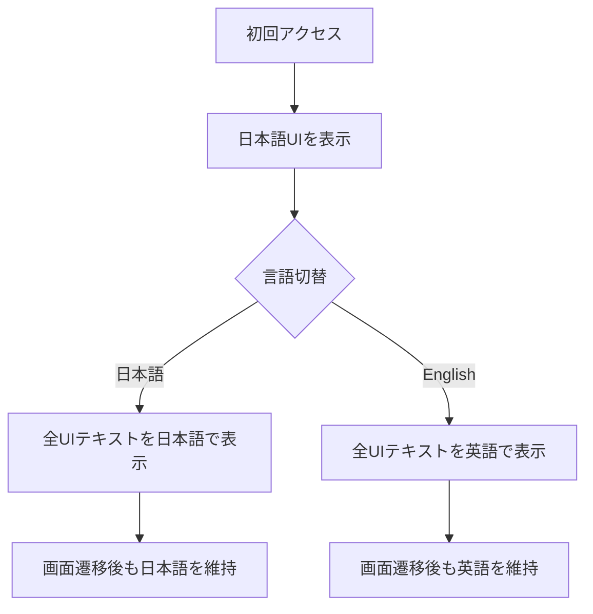

# APIセキュリティ学習・検証プラットフォーム 設計書

## 技術選定

初期実装では、API仕様の明確化、リクエスト検証、認証・認可、レート制限、脆弱デモの隔離を重視します。現在の実装では以下を使用します。

- Frontend: TypeScript + React + Next.js App Router
- Backend: Next.js Route Handlers
- Package manager: npm と `package-lock.json`
- Validation: Zod
- Testing: Vitest
- Linting and formatting: ESLint と Prettier
- API Documentation: OpenAPI。APIモジュールの実装に合わせて追加する
- Database and ORM: 後続フェーズの学習データ用にSQLiteとPrismaを予定する

TypeScriptを採用する理由は、APIリクエスト、レスポンス、認可対象リソース、学習モジュールを型で管理し、脆弱例と安全例の差分を明確にしやすいためです。OpenAPIは、モジュールAPIが具体化した段階でAPI仕様と検証観点を文書化するために使用します。

## アーキテクチャ

## モジュール構成

## BOLA検証シーケンス

## データモデル

## セキュリティ設計

- 脆弱APIは `/vulnerable/*`、安全APIは `/secure/*` のように明確に分離する。
- 脆弱APIでは `LAB_MODE=local` を必須とし、`NODE_ENV=production` では無効化する。
- 脆弱APIを操作する画面には、ローカル限定であることを常に表示する。
- 安全APIでは、ユーザーID、ロール、対象リソース所有者をAPI層で検証する。
- SSRF対策では、許可リスト、プライベートIP範囲拒否、リダイレクト制限、タイムアウトを設計に含める。
- レート制限はユーザー単位、IP単位、APIルート単位で検討する。

初期のルート分離は `/api/vulnerable/health` と `/api/secure/health` で表現します。脆弱APIのヘルスチェックルートは、レスポンスを返す前に共通の安全ガードを通します。

## 多言語UI設計

初期表示は日本語とし、すべての画面で共通ヘッダーまたは共通ナビゲーション内に言語切替を配置します。言語設定はアプリケーション全体で共有し、画面遷移後も選択状態を維持します。

- 学習モジュール名、警告、リクエスト説明、レスポンス説明、防御策、確認項目を翻訳対象に含める。
- 日本語設定では日本語、英語設定では英語に統一する。
- API、BOLA、SSRF、Mass Assignment、OWASPなどの一般的な技術用語は日本語設定でも英語表記を許容する。

## 画面設計

- 学習テーマ一覧: リスクカテゴリ、難易度、進捗、注意事項を表示する。
- 学習詳細: 概要、攻撃条件、防御方針、比較デモを表示する。
- 比較ビュー: 脆弱APIと安全APIのリクエスト・レスポンスを並べて表示する。
- チェックリスト: 実装時に確認すべき防御観点を表示する。
