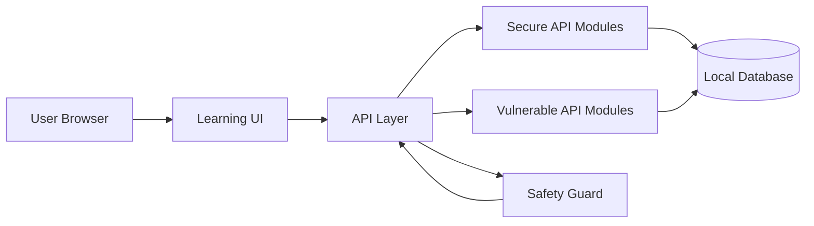
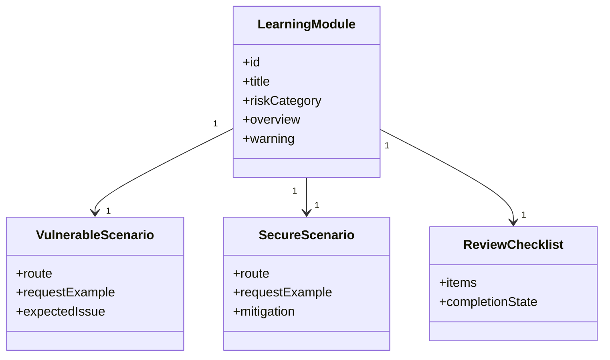
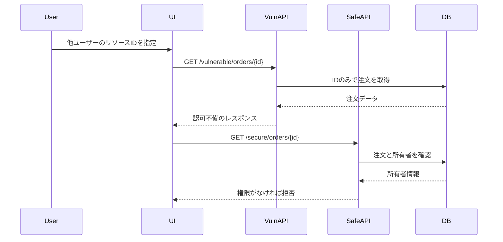
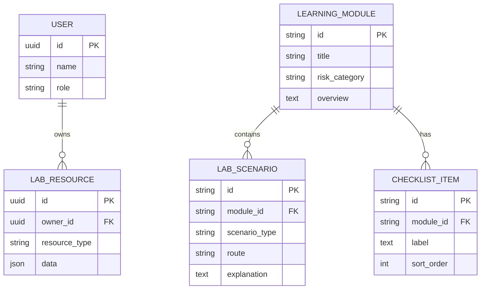
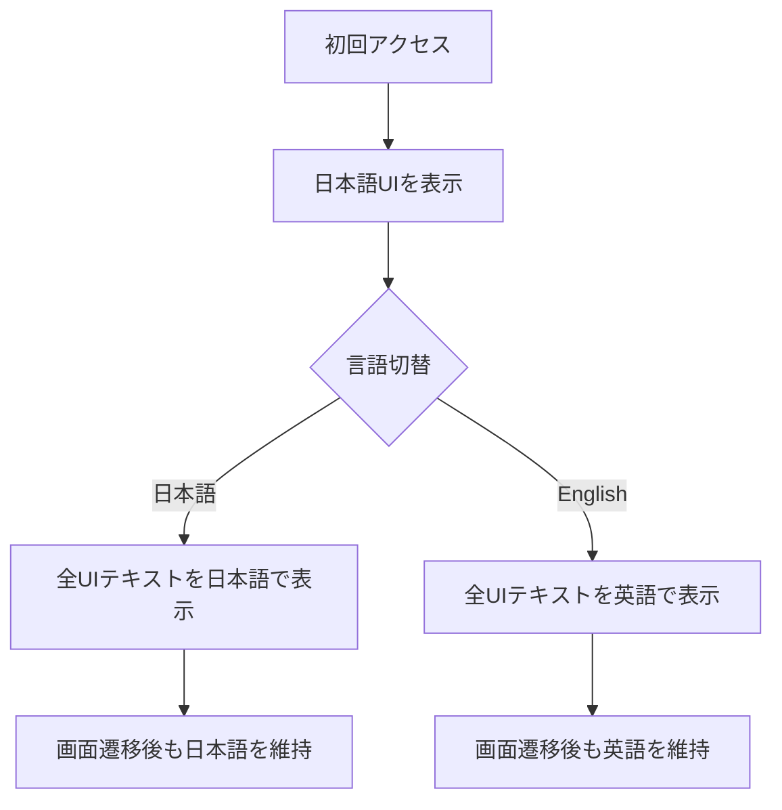

# APIセキュリティ学習・検証プラットフォーム 設計書

## 技術選定

初期実装では、API仕様の明確化、リクエスト検証、認証・認可、レート制限、脆弱デモの隔離を重視します。現在の実装では以下を使用します。

- Frontend: TypeScript + React + Next.js App Router
- Backend: Next.js Route Handlers
- Package manager: npm と `package-lock.json`
- Validation: Zod
- Testing: Vitest
- Linting and formatting: ESLint と Prettier
- API Documentation: `docs/api/openapi.json` のOpenAPI仕様
- Database and ORM: 後続フェーズの学習データ用にSQLiteとPrismaを予定する

TypeScriptを使用する理由は、APIリクエスト、レスポンス、認可対象リソース、学習モジュールを型で管理し、脆弱例と安全例の差分を明確にしやすいためです。OpenAPIは、モジュールAPIが具体化した段階でAPI仕様と検証観点を文書化するために使用します。

## アーキテクチャ

## モジュール構成

## BOLA検証シーケンス

## データモデル

## セキュリティ設計

- 脆弱APIは `/vulnerable/*`、安全APIは `/secure/*` のように明確に分離する。
- 脆弱APIでは `LAB_MODE=local` を必須とし、`NODE_ENV=production` では無効化する。
- 脆弱APIを操作する画面には、ローカル限定であることを常に表示する。
- 安全APIでは、ユーザーID、ロール、対象リソース所有者をAPI層で検証する。
- SSRF対策では、許可リスト、プライベートIP範囲拒否、リダイレクト制限、タイムアウトを設計に含める。
- レート制限はユーザー単位、IP単位、APIルート単位で検討する。

初期のルート分離は `/api/vulnerable/health`、`/api/secure/health`、`/api/vulnerable/lab-samples`、`/api/secure/lab-samples`、`/api/vulnerable/orders/{orderId}`、`/api/secure/orders/{orderId}`、`/api/vulnerable/auth/session`、`/api/secure/auth/session` で表現します。脆弱APIルートは、レスポンスを返す前に共通の安全ガードを通します。

## API基盤

- 共通APIレスポンスは `src/lib/api-response.ts` で定義し、成功時は `{ ok, data, meta }`、エラー時は `{ ok, error, meta }` を返す。
- 共通リクエスト検証は `src/lib/request-validation.ts` で定義し、`src/lib/api-schemas.ts` のZodスキーマを使用する。
- ローカル用のサンプルユーザーとサンプルリソースは `src/data/lab-samples.ts` で定義する。合成したデモ用IDだけを使用し、実在する個人情報、ログ、認証情報、トークンは含めない。
- `src/lib/lab-sample-service.ts` は、永続化フェーズ前にデータベース依存を増やさず、APIモジュールへフィルタ済みサンプルデータを提供する。
- `docs/api/openapi.json` では、現在の補助ルート、安全/脆弱タグの分離、共通の成功/エラーレスポンス形式、脆弱ルートのローカル限定動作を記述する。

## BOLAモジュール設計

- 脆弱なBOLAルート `/api/vulnerable/orders/{orderId}` は、ローカル限定の安全ガードを通過した後、ローカル用デモ注文をIDのみで取得する。
- 安全なBOLAルート `/api/secure/orders/{orderId}` は `userId` を必須とし、指定された注文がそのデモユーザーの所有物かを検証する。
- 比較UIでは、所有者ではないユーザーとして `order-demo-002` を実行し、脆弱ルートでは注文が返り、安全ルートでは `403 FORBIDDEN` が返ることを確認できる。
- BOLA実装では合成したデモユーザーとデモリソースのみを使用し、実在するアカウント、注文、ログ、トークンは使用しない。

## 認証モジュール設計

- 脆弱な認証ルート `/api/vulnerable/auth/session` は、ローカル限定の安全ガードを通過した後、既知のデモトークンIDだけを見てセッションを受け入れる。
- 安全な認証ルート `/api/secure/auth/session` は、デモトークンの署名状態、期限、失効状態、必要な権限を確認してからセッションを受け入れる。
- 比較UIでは、署名状態が不正、期限切れ、失効済みの `demo-token-expired-admin` を使用する。脆弱ルートでは受け入れられ、安全ルートでは `401 UNAUTHORIZED` が返ることを確認できる。
- 認証モジュールでは合成したトークンIDとメタデータのみを使用し、実トークン、署名鍵、秘密情報、認証情報、実セッションは含めない。

## 多言語UI設計

初期表示は日本語とし、すべての画面で共通ヘッダーまたは共通ナビゲーション内に言語切替を配置します。言語設定はアプリケーション全体で共有し、画面遷移後も選択状態を維持します。

- 学習モジュール名、警告、リクエスト説明、レスポンス説明、防御策、確認項目を翻訳対象に含める。
- 日本語設定では日本語、英語設定では英語に統一する。
- API、BOLA、SSRF、Mass Assignment、OWASPなどの一般的な技術用語は日本語設定でも英語表記を許容する。
- UI文言は `src/lib/i18n.ts`、学習モジュールの内容は `src/data/learning-modules.ts` で管理する。

## 画面設計

- 学習テーマ一覧: 各モジュールのリスクカテゴリ、難易度、進捗、概要、選択状態を表示する。
- 学習詳細: 選択したモジュールの概要、問題が発生する条件、防御方針を表示する。
- 比較ビュー: 脆弱APIと安全APIのルート、リクエスト、レスポンス、設計上の説明を並べて表示する。
- チェックリスト: 選択したモジュールの実装時に確認すべき防御観点を表示する。進捗保存は後続フェーズで追加する。
- 脆弱APIの比較領域には、ローカル限定かつ外部公開禁止であることを常に表示する。
