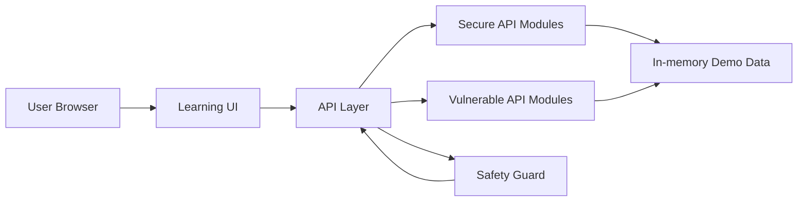
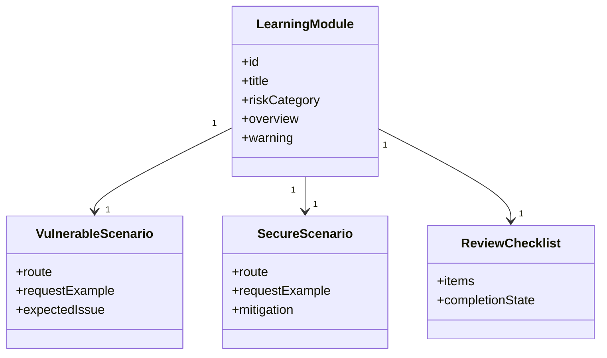
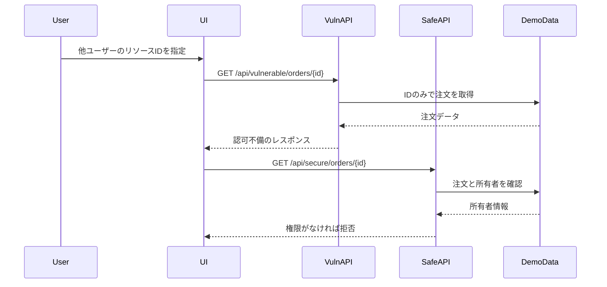
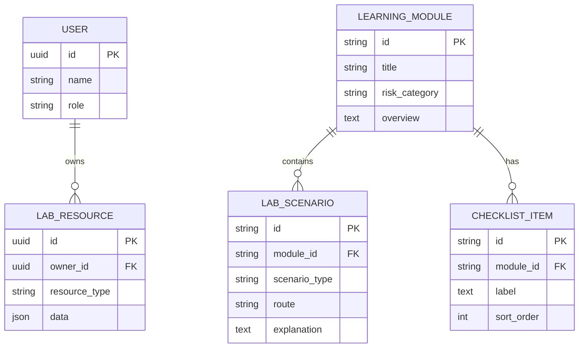
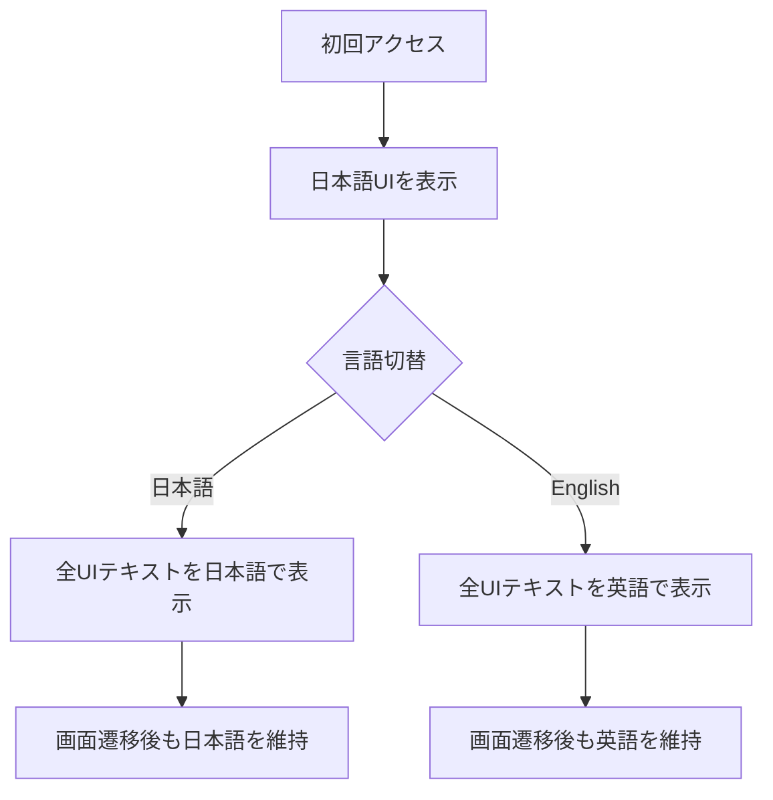

# APIセキュリティ学習・検証プラットフォーム 設計書

## 技術選定

現在の実装では、API仕様の明確化、リクエスト検証、認証・認可、レート制限、脆弱デモの隔離を重視します。使用している技術は以下のとおりです。

- Frontend: TypeScript + React + Next.js App Router
- Backend: Next.js Route Handlers
- Package manager: npm と `package-lock.json`
- Validation: Zod
- Testing: Vitest
- Linting and formatting: ESLint と Prettier
- API Documentation: `docs/api/openapi.json` のOpenAPI仕様
- Database and ORM: 現時点では未導入。今後、SQLiteとPrismaの導入を検討する

TypeScriptを使用する理由は、APIリクエスト、レスポンス、認可対象リソース、学習モジュールを型で管理し、脆弱な例と安全な例の違いを明確にしやすいためです。OpenAPIは、実装済みAPIの仕様と検証観点を文書化するために使用します。

## アーキテクチャ

現在のデモデータは、`src/data/` 配下の合成データとして管理します。永続化が必要になった段階で、ローカルDBを導入します。

## モジュール構成

## BOLA検証シーケンス

## 将来のデータモデル

以下は、永続化を追加する場合の概念モデルです。現在の実装では、実DBではなく合成したローカル用デモデータを使用します。

## セキュリティ設計

- 脆弱APIは `/api/vulnerable/*`、安全APIは `/api/secure/*` として明確に分離する。
- 脆弱APIでは `LAB_MODE=local` を必須とし、`NODE_ENV=production` では無効化する。
- 脆弱APIを操作する画面には、ローカル限定であり外部公開してはいけないことを常に表示する。
- 安全APIでは、ユーザーID、ロール、対象リソース所有者をAPI層で検証する。
- SSRF対策では、実ネットワークアクセスを行わず、許可リスト、プライベートホスト拒否、リダイレクト方針、タイムアウト方針をプレビューとして返す。
- レート制限は、現在はデモユーザーとAPIルート単位で適用する。送信元単位の制限は今後の拡張候補とする。

ヘルスチェック、サンプルデータ、BOLA注文、認証セッション、レート制限検索、プロフィール更新、URL取得プレビューの各Route Handlerを `/api/vulnerable/*` と `/api/secure/*` に分けます。脆弱APIルートは、レスポンスを返す前に共通の安全ガードを通します。

## API基盤

- 共通APIレスポンスは `src/lib/api-response.ts` で定義し、成功時は `{ ok, data, meta }`、エラー時は `{ ok, error, meta }` を返す。
- 共通リクエスト検証は `src/lib/request-validation.ts` で定義し、`src/lib/api-schemas.ts` のZodスキーマを使用する。
- ローカル用のサンプルユーザーとサンプルリソースは `src/data/lab-samples.ts` で定義する。合成したデモ用IDだけを使用し、実在する個人情報、ログ、認証情報、トークンは含めない。
- `src/lib/lab-sample-service.ts` は、永続化を導入する前の段階でデータベース依存を増やさず、APIモジュールへフィルタ済みサンプルデータを提供する。
- `docs/api/openapi.json` では、実装済みルート、安全/脆弱タグの分離、共通の成功/エラーレスポンス形式、脆弱ルートのローカル限定動作を記述する。

## BOLAモジュール設計

- 脆弱なBOLAルート `/api/vulnerable/orders/{orderId}` は、ローカル限定の安全ガードを通過した後、ローカル用デモ注文をIDだけで取得する。
- 安全なBOLAルート `/api/secure/orders/{orderId}` は `userId` を必須とし、指定された注文がそのデモユーザーに属するかを検証する。
- 比較UIでは、所有者ではないユーザーとして `order-demo-002` を実行し、脆弱ルートでは注文が返り、安全ルートでは `403 FORBIDDEN` が返ることを確認できる。
- BOLA実装では合成したデモユーザーとデモリソースのみを使用し、実在するアカウント、注文、ログ、トークンは使用しない。

## 認証モジュール設計

- 脆弱な認証ルート `/api/vulnerable/auth/session` は、ローカル限定の安全ガードを通過した後、既知のデモトークンIDだけを見てセッションを受け入れる。
- 安全な認証ルート `/api/secure/auth/session` は、デモトークンの署名状態、期限、失効状態、必要な権限を確認してからセッションを受け入れる。
- 比較UIでは、署名状態が不正、期限切れ、失効済みの `demo-token-expired-admin` を使用する。脆弱ルートでは受け入れられ、安全ルートでは `401 UNAUTHORIZED` が返ることを確認できる。
- 認証モジュールでは合成したトークンIDとメタデータのみを使用し、実トークン、署名鍵、秘密情報、認証情報、実セッションは含めない。

## レート制限・Mass Assignment・SSRFモジュール設計

- 脆弱なレート制限ルート `/api/vulnerable/rate-limit/search` は、繰り返しリクエストに制限を適用しない。安全なルート `/api/secure/rate-limit/search` は、ルートとデモユーザーをキーにしたインメモリの制限を適用し、デモ用の上限を超えた場合は `429 RATE_LIMITED` を返す。
- 脆弱なMass Assignmentルート `/api/vulnerable/profile` は、`ownerId` や `role` など権限が必要な項目も含め、受け入れたプロパティをそのまま適用する。安全なルート `/api/secure/profile` は、許可リストに含まれるプロフィール項目だけを適用し、拒否したプロパティを返す。
- 脆弱なSSRFルート `/api/vulnerable/fetch-url` は、任意URLを受け入れる例として動作する。ただし、実際の外部ネットワークアクセスは行わない。安全なルート `/api/secure/fetch-url` はHTTPSを必須とし、プライベートホストを拒否し、`api.example.test` のみを許可するプレビューを返す。
- SSRFデモでは実際の外部ネットワークアクセスを行わず、脆弱APIと安全APIのどちらもプレビュー用メタデータだけを返す。

## 多言語UI設計

初期表示は日本語とし、すべての画面で共通ヘッダーまたは共通ナビゲーション内に言語切替を配置します。言語設定はアプリケーション全体で共有し、画面遷移後も選択状態を維持します。

- 学習モジュール名、警告、リクエスト説明、レスポンス説明、防御策、確認項目を翻訳対象に含める。
- 日本語設定では日本語、英語設定では英語に統一する。
- API、BOLA、SSRF、Mass Assignment、OWASPなどの一般的な技術用語は日本語設定でも英語表記を許容する。
- UI文言は `src/lib/i18n.ts`、学習モジュールの内容は `src/data/learning-modules.ts` で管理する。

## セキュリティ検証設計

- `src/lib/security-verification.test.ts` は、公開環境に相当する設定ですべての脆弱APIが `403 VULNERABLE_API_DISABLED` を返すことを横断的に確認する。
- 同テストでは、安全APIがBOLA、認証不備、Mass Assignment、SSRF、レート制限不足を再現しないことを確認する。
- `src/lib/openapi.test.ts` は、すべての脆弱API操作にローカル限定の説明と公開環境相当での無効化レスポンスが記述されていることを確認する。
- UI文言リソースは、日英のキー構造が揃っていることをテストし、共通画面ラベルの言語混在を避ける。

## 画面設計

- 学習テーマ一覧: 各モジュールのリスクカテゴリ、難易度、進捗、概要、選択状態を表示する。
- 学習詳細: 選択したモジュールの概要、脆弱性が生じる条件、防御設計を表示する。
- 比較ビュー: 脆弱APIと安全APIのルート、リクエスト、レスポンス、設計上の説明を並べて表示する。
- チェックリスト: 選択したモジュールの実装時に確認すべき防御観点を表示する。現在、進捗は保存しない。
- 脆弱APIの比較領域には、ローカル限定かつ外部公開禁止であることを常に表示する。
