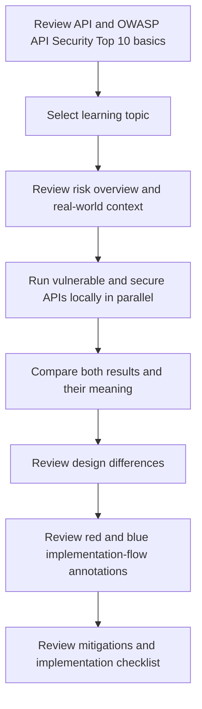

# API Security Lab Platform Proposal

## Background

Web services and mobile applications often rely on APIs as the center of their functionality. Since APIs are directly consumed by frontends, mobile clients, and external services, authorization flaws, weak authentication, excessive data exposure, missing rate limits, business-flow abuse, security misconfiguration, legacy API inventory gaps, and overtrusted third-party API responses can directly affect user data and business operations.

This system is designed as an environment for examining representative API security issues by comparing vulnerable examples with secure implementations. The goal is not merely to demonstrate attacks, but to explain API basics, OWASP API Security Top 10 perspectives, vulnerable conditions, and defensive design decisions in one learning flow.

## Objectives

- Understand representative risks related to the OWASP API Security Top 10 2023 at the implementation level. Official reference: <https://owasp.org/API-Security/editions/2023/en/0x11-t10/>.
- Compare vulnerable APIs and secure APIs to clarify defensive design differences.
- Verify object authorization, function-level authorization, authentication, rate limiting, business-flow controls, security configuration, API inventory management, input validation, outbound request control, and third-party API response validation.
- Define an isolation model for safely handling vulnerable demos in a local-only environment.

## Target Users

- API developer: reviews secure API design and implementation patterns.
- Security learner: understands causes and mitigations of API vulnerabilities through comparison.
- Security reviewer: organizes API security review perspectives.

## Scope

- Covers BOLA, authentication and token validation, Mass Assignment, rate limiting, Broken Function Level Authorization, Sensitive Business Flows, SSRF, Security Misconfiguration, Improper Inventory Management, and Unsafe Consumption of APIs as learning topics.
- Separates `/api/vulnerable/*` and `/api/secure/*` so vulnerable and secure behavior can be compared for the same topic.
- SSRF and third-party API response demos return verification preview metadata or synthetic responses only and do not perform real outbound network access.
- The UI defaults to Japanese and can be switched to English through a shared language switcher.

## Development Process Decision

An agile process is appropriate because each verification topic, such as BOLA, broken authentication, missing rate limits, Broken Function Level Authorization, Sensitive Business Flows, mass assignment, SSRF, Security Misconfiguration, Improper Inventory Management, and Unsafe Consumption of APIs, can be added as an independent learning module.

However, because vulnerable API examples are included, local-only execution, non-public deployment, route separation, and warning displays must be defined from the beginning.

## Learning Flow

## UI/UX Direction

Each learning module provides a comparison screen for the vulnerable implementation, secure implementation, request example, response example, design differences, implementation flow, and defensive checklist. The implementation flow shows the full API program flow, highlights vulnerable problem areas in red, and highlights secure improvements in blue. After an API demo runs, the UI shows both the response and what the result means.

The top-level screen explains what an API is and how OWASP API Security Top 10 is used. Each topic detail separates the overview, real-world context and impact examples, vulnerable conditions, and defensive design so beginners can follow the purpose of each comparison.

Comparison areas that operate vulnerable APIs must clearly state that they are local-only and must not be publicly deployed.

The default UI language is Japanese, and every screen should include a shared language switcher. When English mode is selected, all visible UI text should be consistently displayed in English.
