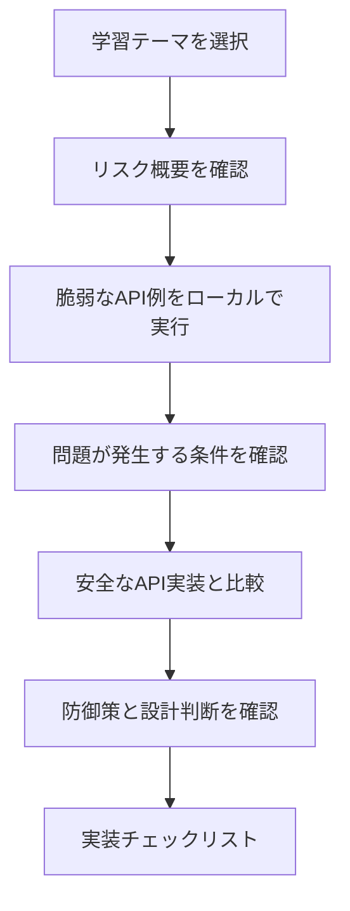

# APIセキュリティ学習・検証プラットフォーム 企画書

## 背景

Webサービスやモバイルアプリケーションでは、APIが機能提供の中心になることが多くあります。APIはフロントエンド、モバイルアプリ、外部サービスから直接利用されるため、認可不備、認証不備、過剰なデータ公開、レート制限不足、業務フローの悪用、セキュリティ設定不備、旧API管理の不備、外部API応答の過信などが発生すると、利用者データや業務処理に直接影響します。

このシステムは、APIセキュリティ上の代表的な問題を、脆弱な例と安全な例を比較しながら検証できる環境として設計します。単に攻撃手法を示すのではなく、なぜ問題が起きるのか、どの設計判断で防げるのかを理解できることを重視します。

## 目的

- OWASP API Security Top 10 2023に関連する代表的なリスクを実装レベルで理解する。公式URL: <https://owasp.org/API-Security/editions/2023/en/0x11-t10/>。
- 脆弱なAPIと安全なAPIを比較し、防御設計の差分を明確にする。
- オブジェクト単位の認可、機能単位の認可、認証、レート制限、業務フロー制御、セキュリティ設定、APIインベントリ管理、入力検証、外部リクエスト制御、外部API応答検証を具体的に検証する。
- 脆弱なデモをローカル限定で安全に扱うための隔離設計を明確にする。

## 想定利用者

- API開発者: 安全なAPI設計と実装パターンを確認する。
- セキュリティ学習者: API脆弱性の原因と対策を比較しながら理解する。
- セキュリティ担当者: APIセキュリティレビューの観点を整理する。

## 対象範囲

- BOLA、認証とトークン検証、レート制限、Broken Function Level Authorization、Sensitive Business Flows、Mass Assignment、SSRF、Security Misconfiguration、Improper Inventory Management、Unsafe Consumption of APIsを学習テーマとして扱う。
- `/api/vulnerable/*` と `/api/secure/*` を分離し、同じテーマで脆弱な挙動と安全な挙動を比較できるようにする。
- SSRFデモと外部API応答デモでは、実際の外部ネットワークアクセスを行わず、検証用のプレビュー情報または合成応答だけを返す。
- 画面は日本語を初期表示とし、共通の言語切替で英語表示へ切り替えられるようにする。

## 開発プロセスの判断

本システムはアジャイル型で進めることが適しています。BOLA、認証不備、レート制限不足、Broken Function Level Authorization、Sensitive Business Flows、Mass Assignment、SSRF、Security Misconfiguration、Improper Inventory Management、Unsafe Consumption of APIsなどの検証テーマを独立したモジュールとして段階的に追加できるためです。

ただし、脆弱なAPI例を扱うため、ローカル限定、外部公開禁止、脆弱ルートの分離、警告表示といった安全性の前提は初期段階から定義します。

## 学習フロー

## UI/UX方針

各学習テーマでは、脆弱な実装、安全な実装、リクエスト例、レスポンス例、防御策を並べて比較できる画面を用意します。脆弱なAPIを操作する場面では、ローカル限定であることと、外部公開してはいけないことを明確に表示します。

初期表示言語は日本語とし、すべての画面に共通の言語切替を配置します。英語表示に切り替えた場合は、画面全体のUIテキストを英語に統一します。
