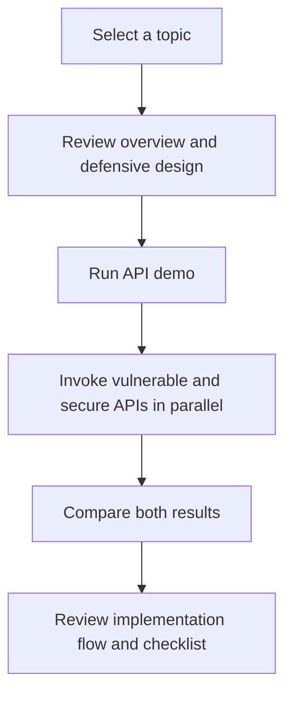

# API Security Lab Platform Requirements

## Functional Requirements

| ID    | Requirement                     | Description                                                                                                                                                                         |
| ----- | ------------------------------- | ----------------------------------------------------------------------------------------------------------------------------------------------------------------------------------- |
| FR-01 | Learning topic list             | Display API security learning topics.                                                                                                                                               |
| FR-02 | Vulnerable API demo             | Run vulnerable API examples in a local-only environment.                                                                                                                            |
| FR-03 | Secure API demo                 | Run secure implementations for the same topics.                                                                                                                                     |
| FR-04 | Comparison view                 | Compare requests, responses, design differences, the full API program flow, and implementation-flow problem/improvement points between vulnerable and secure examples.              |
| FR-05 | BOLA scenario                   | Demonstrate object-level authorization flaws and mitigations.                                                                                                                       |
| FR-06 | Authentication scenario         | Demonstrate authentication and token handling issues and mitigations.                                                                                                               |
| FR-07 | Rate limiting scenario          | Demonstrate designs for limiting excessive requests.                                                                                                                                |
| FR-08 | Function authorization scenario | Demonstrate risks and mitigations for administrative functions exposed without feature-level authorization.                                                                         |
| FR-09 | Business flow scenario          | Demonstrate excessive use and skipped-step risks in sensitive reservation or purchase flows.                                                                                        |
| FR-10 | Mass assignment scenario        | Demonstrate unauthorized property update risks and mitigations.                                                                                                                     |
| FR-11 | SSRF scenario                   | Demonstrate risks and defenses for outbound URL fetching.                                                                                                                           |
| FR-12 | Security configuration scenario | Demonstrate diagnostic exposure, permissive CORS, and missing security header risks and mitigations.                                                                                |
| FR-13 | API inventory scenario          | Demonstrate risks and mitigations for executable legacy or unmanaged APIs.                                                                                                          |
| FR-14 | Third-party response scenario   | Demonstrate overtrusted third-party API response risks and trust-boundary validation.                                                                                               |
| FR-15 | Language switching              | All screens support switching between Japanese and English. The default UI language is Japanese.                                                                                    |
| FR-16 | Theme switching                 | The shared header provides sun and moon controls for switching between persistent light and dark themes.                                                                            |
| FR-17 | Public showcase                 | Public deployment disables live API execution but lets users render representative request results from synthetic data in the existing comparison panels without a network request. |

## Non-Functional Requirements

- Vulnerable APIs are local-only.
- Vulnerable APIs and secure APIs are clearly separated by routes, labels, and explanations.
- Public deployment is limited to the read-only public showcase; API demos remain local-only.
- Learning screens support desktop and mobile viewing.
- Warnings, errors, and success states are displayed clearly.

## Security Requirements

| ID    | Requirement                  | Description                                                                                                                                                                                                                                                                                                                                                                                 |
| ----- | ---------------------------- | ------------------------------------------------------------------------------------------------------------------------------------------------------------------------------------------------------------------------------------------------------------------------------------------------------------------------------------------------------------------------------------------- |
| SR-01 | Local-only execution         | README and UI screens must state that vulnerable APIs must not be deployed publicly.                                                                                                                                                                                                                                                                                                        |
| SR-02 | Route separation             | Vulnerable APIs and secure APIs are clearly separated to prevent accidental misuse.                                                                                                                                                                                                                                                                                                         |
| SR-03 | Authorization checks         | Secure APIs validate the relationship between finite synthetic scenario principals and target resources. Real services must derive principals from validated sessions or tokens.                                                                                                                                                                                                            |
| SR-04 | Input validation             | Request bodies, queries, and URLs are schema-validated; duplicate scalar parameters and unknown fields in strict schemas are rejected.                                                                                                                                                                                                                                                      |
| SR-05 | Rate limiting                | Secure APIs limit excessive requests as a single-process demonstration control.                                                                                                                                                                                                                                                                                                             |
| SR-06 | Function-level authorization | Secure APIs validate required permissions for administrative functions with deny-by-default behavior.                                                                                                                                                                                                                                                                                       |
| SR-07 | Business flow control        | Secure APIs validate sensitive workflow order, per-user limits, and stock constraints.                                                                                                                                                                                                                                                                                                      |
| SR-08 | SSRF protection              | URL validation previews use allowlists, private host rejection, and redirect policy metadata without real network access.                                                                                                                                                                                                                                                                   |
| SR-09 | Security configuration       | Secure APIs suppress debug details, compare the actual `Origin` with the request target without enabling cross-origin access, apply security headers, and disable diagnostic caching.                                                                                                                                                                                                       |
| SR-10 | API inventory management     | Secure APIs validate API environment, version, exposure, owner, lifecycle state, and protection parity before processing.                                                                                                                                                                                                                                                                   |
| SR-11 | External response validation | Third-party API responses are treated as untrusted input and validated for provider identity, redirect target, schema, and privileged fields.                                                                                                                                                                                                                                               |
| SR-12 | Secret management            | `.env`, keys, and tokens are excluded from Git tracking.                                                                                                                                                                                                                                                                                                                                    |
| SR-13 | Request boundary             | JSON bodies require `application/json` with optional `charset=utf-8`, valid UTF-8 and JSON, and declared and actual sizes no greater than 16 KiB.                                                                                                                                                                                                                                           |
| SR-14 | Browser defenses             | HTML uses a per-request nonce. Production `script-src` and `style-src` permit no `'unsafe-inline'`, `script-src` also permits no `'unsafe-eval'`, and style and script attributes are denied with `'none'`. APIs use a CSP based on `default-src 'none'`; frame denial, MIME-sniffing prevention, referrer restrictions, and feature restrictions remain in place.                          |
| SR-15 | Secure development process   | Vulnerable APIs default to disabled and require development/test mode, loopback URL/Host checks, and loopback binding. CI runs dependency audit, formatting, lint, tests, type-checking, and build on pushes, pull requests, manual dispatches, and weekly schedules. Scheduled runs do not deploy; candidate npm and GitHub Actions updates are verified through Dependabot pull requests. |
| SR-16 | Public API shutdown          | With `PUBLIC_SHOWCASE=true`, every `/api/*` request is rejected before route handling, including secure routes, and API responses remain non-cacheable.                                                                                                                                                                                                                                     |

## Verification Requirements

- Tests verify that every vulnerable API is disabled in production-like settings.
- Secure APIs must not reproduce BOLA, weak authentication, missing rate limiting, broken function-level authorization, business-flow abuse, Mass Assignment, SSRF, security misconfiguration, legacy API inventory gaps, or overtrusted third-party response behavior.
- OWASP API Security Top 10 2023 is used as the risk-category reference. Official reference: <https://owasp.org/API-Security/editions/2023/en/0x11-t10/>.
- SSRF demos must not perform real outbound network access from either vulnerable or secure APIs.
- Security misconfiguration demos must not expose real configuration, secrets, personal data, or real logs from either vulnerable or secure APIs.
- API inventory demos must not issue real tokens or send notifications from either vulnerable or secure APIs.
- Third-party API response demos must not perform real external API calls from either vulnerable or secure APIs.
- OpenAPI must document implemented API routes, inputs, error responses, and safety notes.
- Tests must discover secure and vulnerable Route Handler files and exported HTTP methods, require paired route families, verify the local-only guard in every vulnerable operation, and reject omissions from OpenAPI or the production-like vulnerable-route verification matrix.
- CI must inspect Git-tracked files before dependency installation and reject environment files other than `.env.example`, developer-only documents, key material, local databases, and logs.
- Japanese and English UI modes must keep visible text consistent within the selected language.
- Desktop and mobile Chromium tests run automated WCAG 2.0, 2.1, and 2.2 A/AA checks with axe against both the initial Japanese state and the English, dark-theme, result-visible state of a public-showcase-equivalent environment, with no automatically detectable violations.
- Primary theme, language, and request-result controls must operate by keyboard, and keyboard focus must reach horizontally scrollable result regions.
- The opening dialog must provide initial focus and a Tab/Shift+Tab focus trap, close through Escape and its skip control, move focus to the first main-screen control after closing, and be bypassed when reduced motion is requested.
- Desktop and mobile tests must select all ten public-showcase learning topics in Japanese and English and verify selection state, topic-specific synthetic result statuses, no-network result rendering, and no automatically detectable axe violations.
- Tests verify that an unset or invalid `LAB_MODE` keeps vulnerable APIs disabled and that only explicit local mode with loopback request conditions enables them. CI starts the development server in local mode, confirms the vulnerable health route over loopback, rejects a non-loopback `Host` header, and verifies that non-loopback IPv4 interfaces cannot connect to the server port.
- Invalid UTF-8, malformed JSON, unsupported content types, and bodies larger than 16 KiB are rejected with consistent 400, 415, and 413 responses. Inventory-driven tests require shared JSON parsing in every POST and PATCH operation and execute unsupported-content-type, declared-size, and actual-size checks against every corresponding Route Handler, including acceptance of exactly 16 KiB for schema validation.
- Tests verify that the HTML nonce changes on every request, every script and style element receives the matching nonce, production `script-src` and `style-src` contain no `'unsafe-inline'`, and `script-src` contains no `'unsafe-eval'`. Tests also verify that HTML has no style attributes, `style-src-attr 'none'` and `script-src-attr 'none'` are enforced, and both HTML and API responses use `no-store`. Every API operation must return the shared CSP, cross-origin protections, permissions, referrer, MIME-sniffing, and frame-denial headers without CORS allow headers. Local Next.js and public workerd HTTP checks verify the same API header contract and the absence of `X-Powered-By`.
- Public showcase tests and a workerd preview verify that secure and vulnerable API routes both return `403 PUBLIC_SHOWCASE_API_DISABLED` before route handling.
- Component tests verify that the public request-result control appears after the API examples and renders both comparison results without calling `fetch`; static-data tests cover every learning module.
- Local-mode component tests select all ten learning topics and verify each live demo request method, URL, and JSON body, including the four-request secure rate-limit sequence. Network and JSON parsing failures must clear the running state and display the selected language's error message.
- Playwright desktop and mobile Chromium tests verify that no CSP violation occurs, the public control makes no `/api` request, vulnerable and secure request results render, theme selection persists, and Japanese/English switching works.
- Desktop and mobile Chromium screenshot tests compare the initial Japanese light-theme viewport and representative English dark-theme comparison regions with OS-specific baselines after fonts, animation frames, and document animations have settled.

### Requirements-to-Verification Traceability

The following diagram connects representative safety requirements to the implementation or verification elements that satisfy them. The requirement tables above remain the source of truth for the complete list and details.

```mermaid
requirementDiagram
    requirement local_only {
        id: "SR-01"
        text: "Run vulnerable APIs locally only"
        risk: High
        verifymethod: Test
    }

    requirement route_separation {
        id: "SR-02"
        text: "Separate vulnerable and secure API routes"
        risk: High
        verifymethod: Inspection
    }

    functionalRequirement secure_controls {
        id: "SR-03..SR-11"
        text: "Apply risk-specific controls to secure APIs"
        risk: High
        verifymethod: Test
    }

    designConstraint secret_exclusion {
        id: "SR-12"
        text: "Exclude environment files, keys, and tokens from Git"
        risk: High
        verifymethod: Inspection
    }

    designConstraint platform_hardening {
        id: "SR-13..SR-15"
        text: "Apply request boundaries, browser defenses, and secure delivery checks"
        risk: High
        verifymethod: Test
    }

    functionalRequirement bilingual_ui {
        id: "FR-15"
        text: "Provide consistent Japanese and English UI modes"
        risk: Medium
        verifymethod: Test
    }

    element security_tests {
        type: "Vitest test suite"
        docref: "src/lib/security-verification.test.ts"
    }

    element openapi_contract {
        type: "OpenAPI specification and verification"
        docref: "docs/api/openapi.json / src/lib/openapi.test.ts"
    }

    element route_handlers {
        type: "Next.js Route Handlers"
        docref: "src/app/api/secure / src/app/api/vulnerable"
    }

    element repository_exclusions {
        type: "Git exclusion rules"
        docref: ".gitignore / scripts/verify-repository-safety.mjs"
    }

    element ui_resources {
        type: "Japanese and English UI resources"
        docref: "src/lib/i18n.ts"
    }

    element shared_security_pipeline {
        type: "Shared request handling, response headers, and CI"
        docref: "src/lib/request-validation.ts / next.config.ts / .github/workflows"
    }

    security_tests - verifies -> local_only
    security_tests - verifies -> secure_controls
    openapi_contract - verifies -> route_separation
    route_handlers - satisfies -> route_separation
    route_handlers - satisfies -> secure_controls
    repository_exclusions - satisfies -> secret_exclusion
    ui_resources - satisfies -> bilingual_ui
    shared_security_pipeline - satisfies -> platform_hardening
```

## Learning Module Interaction Flow

The current UI does not persist completion state. In the local lab, running a demo invokes the vulnerable and secure APIs in parallel. In public showcase mode, the control loads representative results from static client data into the same result panels and sends no API request.

## UI/UX Requirements

- Screens that run vulnerable APIs must display clear warnings.
- Vulnerable and secure examples are separated by color, labels, and explanations.
- Request and response examples use a layout that makes comparison easy.
- A shared language switcher must be available on every screen.
- A shared theme switcher must expose labeled sun and moon controls, indicate the selected theme, and remain keyboard accessible.
- Interactive targets must provide a size of at least 24 CSS pixels or sufficient spacing and expose a visible keyboard focus indicator.
- Japanese mode must keep visible UI text in Japanese.
- English mode must keep visible UI text in English.
- Common technical terms such as API, BOLA, SSRF, CVSS, CWE, and OWASP may remain in English in Japanese mode.
- Public showcase mode must explain in the selected language that live API execution is disabled and that API demos are local-only.
- The public `Show request results` control must appear after the API examples, remain clearly distinguished from live execution, and render both vulnerable and secure results without network access.
