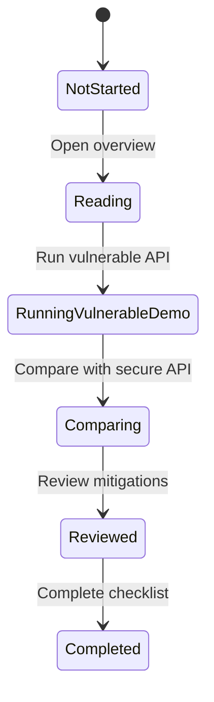

# API Security Lab Platform Requirements

## Functional Requirements

| ID | Requirement | Description |
|---|---|---|
| FR-01 | Learning topic list | Display API security learning topics. |
| FR-02 | Vulnerable API demo | Run vulnerable API examples in a local-only environment. |
| FR-03 | Secure API demo | Run secure implementations for the same topics. |
| FR-04 | Comparison view | Compare requests, responses, and design differences between vulnerable and secure examples. |
| FR-05 | BOLA scenario | Demonstrate object-level authorization flaws and mitigations. |
| FR-06 | Authentication scenario | Demonstrate authentication and token handling issues and mitigations. |
| FR-07 | Rate limiting scenario | Demonstrate designs for limiting excessive requests. |
| FR-08 | Mass assignment scenario | Demonstrate unauthorized property update risks and mitigations. |
| FR-09 | SSRF scenario | Demonstrate risks and defenses for outbound URL fetching. |
| FR-10 | Language switching | All screens support switching between Japanese and English. The default UI language is Japanese. |

## Non-Functional Requirements

- Vulnerable APIs are local-only.
- Vulnerable APIs and secure APIs are clearly separated by routes, labels, and explanations.
- Public deployment is not assumed.
- Learning screens support desktop and mobile viewing.
- Warnings, errors, and success states are displayed clearly.

## Security Requirements

| ID | Requirement | Description |
|---|---|---|
| SR-01 | Local-only execution | README and UI screens must state that vulnerable APIs must not be publicly deployed. |
| SR-02 | Route separation | Vulnerable APIs and secure APIs are clearly separated to prevent accidental misuse. |
| SR-03 | Authorization checks | Secure APIs always validate the relationship between user and target resource. |
| SR-04 | Input validation | Request bodies, queries, and URLs are validated with schemas. |
| SR-05 | Rate limiting | Secure APIs limit excessive requests. |
| SR-06 | SSRF protection | Outbound URL fetching uses allowlists, IP range restrictions, and redirect control. |
| SR-07 | Secret management | `.env`, keys, and tokens are excluded from Git tracking. |

## Learning Module State Transition

## UI/UX Requirements

- Screens that run vulnerable APIs must display clear warnings.
- Vulnerable and secure examples are separated by color, labels, and explanations.
- Request and response examples use a layout that makes comparison easy.
- A shared language switcher must be available on every screen.
- Japanese mode must keep visible UI text in Japanese.
- English mode must keep visible UI text in English.
- Common technical terms such as API, BOLA, SSRF, CVSS, CWE, and OWASP may remain in English in Japanese mode.
