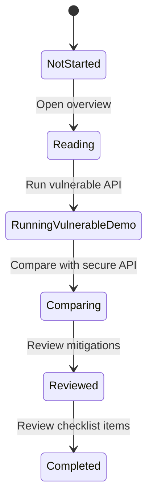

# API Security Lab Platform Requirements

## Functional Requirements

| ID    | Requirement                     | Description                                                                                                                                                            |
| ----- | ------------------------------- | ---------------------------------------------------------------------------------------------------------------------------------------------------------------------- |
| FR-01 | Learning topic list             | Display API security learning topics.                                                                                                                                  |
| FR-02 | Vulnerable API demo             | Run vulnerable API examples in a local-only environment.                                                                                                               |
| FR-03 | Secure API demo                 | Run secure implementations for the same topics.                                                                                                                        |
| FR-04 | Comparison view                 | Compare requests, responses, design differences, the full API program flow, and implementation-flow problem/improvement points between vulnerable and secure examples. |
| FR-05 | BOLA scenario                   | Demonstrate object-level authorization flaws and mitigations.                                                                                                          |
| FR-06 | Authentication scenario         | Demonstrate authentication and token handling issues and mitigations.                                                                                                  |
| FR-07 | Rate limiting scenario          | Demonstrate designs for limiting excessive requests.                                                                                                                   |
| FR-08 | Function authorization scenario | Demonstrate risks and mitigations for administrative functions exposed without feature-level authorization.                                                            |
| FR-09 | Business flow scenario          | Demonstrate excessive use and skipped-step risks in sensitive reservation or purchase flows.                                                                           |
| FR-10 | Mass assignment scenario        | Demonstrate unauthorized property update risks and mitigations.                                                                                                        |
| FR-11 | SSRF scenario                   | Demonstrate risks and defenses for outbound URL fetching.                                                                                                              |
| FR-12 | Security configuration scenario | Demonstrate diagnostic exposure, permissive CORS, and missing security header risks and mitigations.                                                                   |
| FR-13 | API inventory scenario          | Demonstrate risks and mitigations for executable legacy or unmanaged APIs.                                                                                             |
| FR-14 | Third-party response scenario   | Demonstrate overtrusted third-party API response risks and trust-boundary validation.                                                                                  |
| FR-15 | Language switching              | All screens support switching between Japanese and English. The default UI language is Japanese.                                                                       |

## Non-Functional Requirements

- Vulnerable APIs are local-only.
- Vulnerable APIs and secure APIs are clearly separated by routes, labels, and explanations.
- Public deployment is not assumed.
- Learning screens support desktop and mobile viewing.
- Warnings, errors, and success states are displayed clearly.

## Security Requirements

| ID    | Requirement                  | Description                                                                                                                                   |
| ----- | ---------------------------- | --------------------------------------------------------------------------------------------------------------------------------------------- |
| SR-01 | Local-only execution         | README and UI screens must state that vulnerable APIs must not be deployed publicly.                                                          |
| SR-02 | Route separation             | Vulnerable APIs and secure APIs are clearly separated to prevent accidental misuse.                                                           |
| SR-03 | Authorization checks         | Secure APIs always validate the relationship between user and target resource.                                                                |
| SR-04 | Input validation             | Request bodies, queries, and URLs are validated with schemas.                                                                                 |
| SR-05 | Rate limiting                | Secure APIs limit excessive requests.                                                                                                         |
| SR-06 | Function-level authorization | Secure APIs validate required permissions for administrative functions with deny-by-default behavior.                                         |
| SR-07 | Business flow control        | Secure APIs validate sensitive workflow order, per-user limits, and stock constraints.                                                        |
| SR-08 | SSRF protection              | URL validation previews use allowlists, private host rejection, and redirect policy metadata without real network access.                     |
| SR-09 | Security configuration       | Secure APIs suppress debug details, constrain CORS with allowlists, apply security headers, and disable caching for diagnostics.              |
| SR-10 | API inventory management     | Secure APIs validate API environment, version, exposure, owner, lifecycle state, and protection parity before processing.                     |
| SR-11 | External response validation | Third-party API responses are treated as untrusted input and validated for provider identity, redirect target, schema, and privileged fields. |
| SR-12 | Secret management            | `.env`, keys, and tokens are excluded from Git tracking.                                                                                      |
| SR-13 | Request boundary             | JSON bodies require `application/json`, valid syntax, and a maximum size of 16 KiB.                                                           |
| SR-14 | Browser defenses             | Shared responses apply CSP, frame denial, MIME-sniffing prevention, referrer restrictions, and feature restrictions.                          |
| SR-15 | Secure development process   | Vulnerable APIs default to disabled with loopback binding, while CI runs dependency audit, formatting, lint, tests, type-checking, and build. |

## Verification Requirements

- Tests verify that every vulnerable API is disabled in production-like settings.
- Secure APIs must not reproduce BOLA, weak authentication, missing rate limiting, broken function-level authorization, business-flow abuse, Mass Assignment, SSRF, security misconfiguration, legacy API inventory gaps, or overtrusted third-party response behavior.
- OWASP API Security Top 10 2023 is used as the risk-category reference. Official reference: <https://owasp.org/API-Security/editions/2023/en/0x11-t10/>.
- SSRF demos must not perform real outbound network access from either vulnerable or secure APIs.
- Security misconfiguration demos must not expose real configuration, secrets, personal data, or real logs from either vulnerable or secure APIs.
- API inventory demos must not issue real tokens or send notifications from either vulnerable or secure APIs.
- Third-party API response demos must not perform real external API calls from either vulnerable or secure APIs.
- OpenAPI must document implemented API routes, inputs, error responses, and safety notes.
- Japanese and English UI modes must keep visible text consistent within the selected language.
- Tests verify that an unset `LAB_MODE` keeps vulnerable APIs disabled and that only explicit local mode enables them.
- Malformed JSON, non-JSON content types, and bodies larger than 16 KiB are rejected with consistent 400, 415, and 413 responses.
- HTML and API responses apply baseline security headers, and API responses use `no-store`.

### Requirements-to-Verification Traceability

The following diagram connects representative safety requirements to the implementation or verification elements that satisfy them. The requirement tables above remain the source of truth for the complete list and details.

```mermaid
requirementDiagram
    requirement local_only {
        id: "SR-01"
        text: "Run vulnerable APIs locally only"
        risk: High
        verifymethod: Test
    }

    requirement route_separation {
        id: "SR-02"
        text: "Separate vulnerable and secure API routes"
        risk: High
        verifymethod: Inspection
    }

    functionalRequirement secure_controls {
        id: "SR-03..SR-11"
        text: "Apply risk-specific controls to secure APIs"
        risk: High
        verifymethod: Test
    }

    designConstraint secret_exclusion {
        id: "SR-12"
        text: "Exclude environment files, keys, and tokens from Git"
        risk: High
        verifymethod: Inspection
    }

    designConstraint platform_hardening {
        id: "SR-13..SR-15"
        text: "Apply request boundaries, browser defenses, and secure delivery checks"
        risk: High
        verifymethod: Test
    }

    functionalRequirement bilingual_ui {
        id: "FR-15"
        text: "Provide consistent Japanese and English UI modes"
        risk: Medium
        verifymethod: Test
    }

    element security_tests {
        type: "Vitest test suite"
        docref: "src/lib/security-verification.test.ts"
    }

    element openapi_contract {
        type: "OpenAPI specification and verification"
        docref: "docs/api/openapi.json / src/lib/openapi.test.ts"
    }

    element route_handlers {
        type: "Next.js Route Handlers"
        docref: "src/app/api/secure / src/app/api/vulnerable"
    }

    element repository_exclusions {
        type: "Git exclusion rules"
        docref: ".gitignore"
    }

    element ui_resources {
        type: "Japanese and English UI resources"
        docref: "src/lib/i18n.ts"
    }

    element shared_security_pipeline {
        type: "Shared request handling, response headers, and CI"
        docref: "src/lib/request-validation.ts / next.config.ts / .github/workflows"
    }

    security_tests - verifies -> local_only
    security_tests - verifies -> secure_controls
    openapi_contract - verifies -> route_separation
    route_handlers - satisfies -> route_separation
    route_handlers - satisfies -> secure_controls
    repository_exclusions - satisfies -> secret_exclusion
    ui_resources - satisfies -> bilingual_ui
    shared_security_pipeline - satisfies -> platform_hardening
```

## Learning Module State Transition

## UI/UX Requirements

- Screens that run vulnerable APIs must display clear warnings.
- Vulnerable and secure examples are separated by color, labels, and explanations.
- Request and response examples use a layout that makes comparison easy.
- A shared language switcher must be available on every screen.
- Japanese mode must keep visible UI text in Japanese.
- English mode must keep visible UI text in English.
- Common technical terms such as API, BOLA, SSRF, CVSS, CWE, and OWASP may remain in English in Japanese mode.
