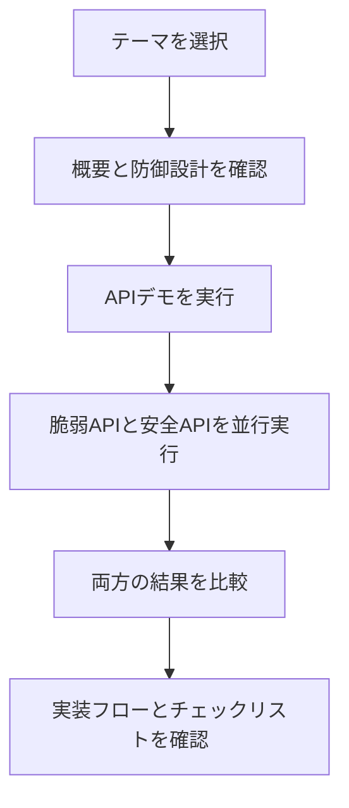

# APIセキュリティ学習・検証プラットフォーム 要件定義書

## 機能要件

| ID    | 要件                     | 概要                                                                                                                                              |
| ----- | ------------------------ | ------------------------------------------------------------------------------------------------------------------------------------------------- |
| FR-01 | 学習テーマ一覧           | APIセキュリティの学習テーマを一覧表示できる。                                                                                                     |
| FR-02 | 脆弱APIデモ              | ローカル限定で脆弱なAPI例を実行できる。                                                                                                           |
| FR-03 | 安全APIデモ              | 同じテーマに対する安全な実装例を実行できる。                                                                                                      |
| FR-04 | 比較表示                 | 脆弱な例と安全な例のリクエスト、レスポンス、設計差分、APIプログラム全体の流れ、実装フローの問題箇所と改善箇所を比較できる。                       |
| FR-05 | BOLAシナリオ             | オブジェクトレベル認可不備の例と対策を確認できる。                                                                                                |
| FR-06 | 認証シナリオ             | 認証不備やトークン管理の問題と対策を確認できる。                                                                                                  |
| FR-07 | レート制限シナリオ       | 過剰リクエストを制限する設計を確認できる。                                                                                                        |
| FR-08 | 機能単位認可シナリオ     | 機能単位の権限を持たない利用者が管理機能を実行できる問題と対策を確認できる。                                                                      |
| FR-09 | 業務フローシナリオ       | 重要な予約・購入フローの過剰利用や、必要な手順を省略する問題と対策を確認できる。                                                                  |
| FR-10 | Mass Assignmentシナリオ  | 許可されていないプロパティ更新の問題と対策を確認できる。                                                                                          |
| FR-11 | SSRFシナリオ             | 外部URL取得時の危険性と防御策を確認できる。                                                                                                       |
| FR-12 | セキュリティ設定シナリオ | 診断情報公開、過度に広いCORS、セキュリティヘッダー不足の問題と対策を確認できる。                                                                  |
| FR-13 | APIインベントリシナリオ  | 旧APIや管理外APIを実行可能な状態で残す問題と対策を確認できる。                                                                                    |
| FR-14 | 外部API応答シナリオ      | 外部API応答を過信する問題と、信頼境界で検証する対策を確認できる。                                                                                 |
| FR-15 | 言語切替                 | すべての画面で日本語と英語を切り替えられる。初期表示は日本語とする。                                                                              |
| FR-16 | テーマ切替               | 共通ヘッダーの太陽・月アイコンのボタンでライトテーマとダークテーマを切り替え、選択を保持できる。                                                  |
| FR-17 | 公開ショーケース         | 公開環境ではライブAPI実行を停止しつつ、ネットワークリクエストを送信せずに、合成データによる代表的なリクエスト結果を既存の比較パネルへ表示できる。 |

## 非機能要件

- 脆弱なAPIはローカル実行限定とする。
- 脆弱なAPIと安全なAPIはルート、表示、説明で明確に分離する。
- 公開環境へのデプロイは読み取り専用の公開ショーケースに限定し、APIデモはローカル限定とする。
- 学習画面はデスクトップとモバイルで閲覧できる。
- 警告、エラー、成功状態を利用者が理解しやすい形で表示する。

## セキュリティ要件

| ID    | 要件             | 内容                                                                                                                                                                                                                                                                                                                                               |
| ----- | ---------------- | -------------------------------------------------------------------------------------------------------------------------------------------------------------------------------------------------------------------------------------------------------------------------------------------------------------------------------------------------- |
| SR-01 | ローカル限定     | 脆弱APIを公開環境へデプロイしてはいけないことをREADMEと画面に明記する。                                                                                                                                                                                                                                                                            |
| SR-02 | ルート分離       | 脆弱APIと安全APIを明確に分離し、誤利用を防ぐ。                                                                                                                                                                                                                                                                                                     |
| SR-03 | 認可検証         | 安全APIでは、有限の合成シナリオ主体と対象リソースの関係を検証する。実サービスでは検証済みセッション等から主体を確定する。                                                                                                                                                                                                                          |
| SR-04 | 入力検証         | リクエスト本文、クエリ、URLをスキーマで検証し、単一値パラメーターの重複やstrictスキーマの未知項目を拒否する。                                                                                                                                                                                                                                      |
| SR-05 | レート制限       | 安全APIでは、単一プロセス内のデモ制御として過剰リクエストを制限する。                                                                                                                                                                                                                                                                              |
| SR-06 | 機能単位認可     | 安全APIでは管理機能に必要な権限を確認し、権限不足をデフォルト拒否（deny-by-default）の方針で拒否する。                                                                                                                                                                                                                                             |
| SR-07 | 業務フロー制御   | 安全APIでは重要な業務フローの順序、ユーザー単位上限、在庫制約を検証する。                                                                                                                                                                                                                                                                          |
| SR-08 | SSRF対策         | 実ネットワークアクセスは行わず、URL検証プレビューで許可リスト、プライベートホスト拒否、リダイレクト方針を確認できるようにする。                                                                                                                                                                                                                    |
| SR-09 | セキュリティ設定 | 安全APIではデバッグ情報を抑制し、実際の `Origin` をリクエスト先と比較してcross-originアクセスを許可せず、セキュリティヘッダーとキャッシュ無効化を診断APIにも適用する。                                                                                                                                                                             |
| SR-10 | API管理          | 安全APIではAPIの環境、バージョン、公開範囲、所有者、退役状態、保護策の適用状況を確認する。                                                                                                                                                                                                                                                         |
| SR-11 | 外部応答検証     | 外部API応答を信頼境界外の入力として扱い、提供元、リダイレクト先、応答スキーマ、権限フィールドを検証する。                                                                                                                                                                                                                                          |
| SR-12 | 秘密情報管理     | `.env`、鍵、トークンをGit管理対象に含めない。                                                                                                                                                                                                                                                                                                      |
| SR-13 | リクエスト境界   | JSON本文は `application/json` と任意の `charset=utf-8` に限定し、UTF-8と構文を検証し、宣言値または実測値が16 KiBを超える本文を拒否する。                                                                                                                                                                                                           |
| SR-14 | ブラウザー防御   | HTMLにはリクエスト単位のnonceを使い、本番の`script-src`と`style-src`で`'unsafe-inline'`を許可せず、`script-src`で`'unsafe-eval'`も許可しないCSPを適用する。style属性とscript属性は`'none'`で拒否する。APIには`default-src 'none'`を基準とするCSPを適用し、フレーム埋め込み拒否、MIMEスニッフィング防止、リファラー情報の制限、機能制限も維持する。 |
| SR-15 | 安全な開発工程   | 脆弱APIを既定無効とし、development/test、loopback URL/Host検査、ループバックアドレス限定の待受を適用する。CIでは依存監査、整形、lint、テスト、型検査、ビルドをpush、Pull Request、手動、週次で実行する。週次実行ではデプロイせず、npm依存関係とGitHub Actionsの更新候補はDependabot Pull Requestで個別に検証する。                                 |
| SR-16 | 公開API停止      | `PUBLIC_SHOWCASE=true`の場合、安全APIを含むすべての`/api/*`リクエストをRoute Handlerへ到達する前に拒否し、APIレスポンスをキャッシュさせない。                                                                                                                                                                                                      |

## 検証要件

- 公開環境相当の設定では、すべての脆弱APIが無効化されることをテストで確認する。
- 安全APIでは、BOLA、認証不備、レート制限不足、機能単位認可不備、業務フロー悪用、Mass Assignment、SSRF、セキュリティ設定不備、旧API管理不備、外部API応答の過信が再現しないことを確認する。
- OWASP API Security Top 10 2023をリスク分類の参照元として使用する。公式URL: <https://owasp.org/API-Security/editions/2023/en/0x11-t10/>。
- SSRFデモでは、脆弱APIと安全APIのどちらも実際の外部ネットワークアクセスを行わないことを確認する。
- Security Misconfigurationデモでは、脆弱APIと安全APIのどちらも実設定、秘密情報、個人情報、実ログを公開しないことを確認する。
- APIインベントリデモでは、脆弱APIと安全APIのどちらも実トークン発行や通知送信を行わないことを確認する。
- 外部API応答デモでは、脆弱APIと安全APIのどちらも実際の外部API通信を行わないことを確認する。
- OpenAPI仕様に、実装済みAPIのルート、入力、エラーレスポンス、安全上の注意が記述されていることを確認する。
- テストでは安全・脆弱Route Handlerの実ファイルとエクスポートされたHTTPメソッドを検出し、両ルート系統の対称性、全脆弱API操作のローカル限定ガードを確認する。OpenAPIまたは公開環境相当の脆弱ルート検証一覧に登録漏れがある場合は拒否する。
- CIでは依存関係をインストールする前にGit追跡対象を検査し、`.env.example`以外の環境変数ファイル、開発者専用文書、鍵、ローカルDB、ログが含まれている場合は拒否する。
- 日本語表示と英語表示で、画面内の文言が同じ言語に統一されていることを確認する。
- 公開ショーケース相当環境のデスクトップ・モバイルChromiumで、日本語初期状態と英語・ダークテーマ・結果表示後の両方に対してaxeによるWCAG 2.0・2.1・2.2 A/AA自動検査を行い、検出可能な違反がないことを確認する。
- テーマ、言語、リクエスト結果の主要操作がキーボードで実行でき、横スクロールする結果領域へキーボードフォーカスを移動できることを確認する。
- オープニングダイアログでは初期フォーカスとTab・Shift+Tabのフォーカストラップが動作し、Escapeとスキップ操作で終了できることを確認する。終了後は通常画面の先頭操作へフォーカスを移し、reduced-motion設定ではオープニングを省略する。
- 公開ショーケースの全10学習テーマを日本語と英語で順番に選択し、選択状態、テーマ固有の合成結果ステータス、通信なしの結果表示、axeによる検出可能な違反がないことをデスクトップ・モバイルで確認する。
- 未設定または不正な`LAB_MODE`で脆弱APIが無効となり、明示的なローカル設定とloopbackリクエスト条件を満たす場合だけ有効になることを確認する。CIでは開発サーバーをローカルモードで起動し、ループバック経由で`/api/vulnerable/health`へ到達できること、ループバック以外の`Host`ヘッダーが拒否されること、ループバック以外のIPv4インターフェースからサーバーポートへ接続できないことを確認する。
- 不正UTF-8、不正JSON、非対応Content-Type、16 KiBを超える本文が統一した400、415、413レスポンスで拒否されることを確認する。ルート一覧に基づくテストでは、すべてのPOST・PATCH操作が共通JSON解析処理を呼び出すことを必須とし、対応する全Route Handlerへ非対応Content-Type、過大な宣言サイズ、過大な実本文を送信するほか、16 KiBちょうどの本文がschema検証へ進むことを確認する。
- HTMLのnonceがリクエストごとに更新され、すべてのscriptとstyle要素へ同じnonceが付与され、本番の`script-src`と`style-src`に`'unsafe-inline'`が含まれず、`script-src`に`'unsafe-eval'`も含まれないことを確認する。HTMLにstyle属性がなく、`style-src-attr 'none'`と`script-src-attr 'none'`が適用されること、HTMLとAPIの両方が`no-store`となることも確認する。
- 公開ショーケースのテストとworkerdプレビューで、安全APIと脆弱APIの両方がRoute Handlerへ到達する前に`403 PUBLIC_SHOWCASE_API_DISABLED`を返すことを確認する。
- コンポーネントテストで、公開用のリクエスト結果操作がAPI例の後に配置され、`fetch`を呼び出さずに両方の比較結果を表示することを確認し、静的データテストで全学習テーマを検証する。
- ローカルモードのコンポーネントテストでは全10学習テーマを選択し、4回連続で安全APIを呼び出すレート制限シナリオを含め、各ライブデモのHTTPメソッド、URL、JSON本文を確認する。通信失敗とJSON解析失敗では実行中状態を解除し、選択中の言語でエラーを表示することも確認する。
- Playwrightのデスクトップ・モバイルChromiumテストで、CSP違反が発生しないこと、公開用操作が`/api`へ通信しないこと、脆弱側・安全側のリクエスト結果表示、テーマ選択の保持、日英切替が動作することを確認する。
- デスクトップ・モバイルChromiumのスクリーンショットテストで、日本語・ライトテーマの初期表示範囲と、英語・ダークテーマの代表的な比較領域を、フォントの読み込み、描画フレーム、文書内アニメーションの完了後にOS別の基準画像と比較する。

### 要件と検証のトレーサビリティ

次の図は、代表的な安全要件と、それを満たす実装要素または検証要素の関係を示します。要件の完全な一覧と詳細は、上の要件表を正とします。

```mermaid
requirementDiagram
    requirement local_only {
        id: "SR-01"
        text: "脆弱APIはローカル限定で実行する"
        risk: High
        verifymethod: Test
    }

    requirement route_separation {
        id: "SR-02"
        text: "脆弱APIと安全APIのルートを分離する"
        risk: High
        verifymethod: Inspection
    }

    functionalRequirement secure_controls {
        id: "SR-03..SR-11"
        text: "安全APIに各リスクへの防御を適用する"
        risk: High
        verifymethod: Test
    }

    designConstraint secret_exclusion {
        id: "SR-12"
        text: "環境変数、鍵、トークンをGit管理から除外する"
        risk: High
        verifymethod: Inspection
    }

    designConstraint platform_hardening {
        id: "SR-13..SR-15"
        text: "入力境界、ブラウザー防御、安全な開発工程を適用する"
        risk: High
        verifymethod: Test
    }

    functionalRequirement bilingual_ui {
        id: "FR-15"
        text: "日本語と英語のUIを一貫して提供する"
        risk: Medium
        verifymethod: Test
    }

    element security_tests {
        type: "Vitestテストスイート"
        docref: "src/lib/security-verification.test.ts"
    }

    element openapi_contract {
        type: "OpenAPI仕様と検証"
        docref: "docs/api/openapi.json / src/lib/openapi.test.ts"
    }

    element route_handlers {
        type: "Next.js Route Handlers"
        docref: "src/app/api/secure / src/app/api/vulnerable"
    }

    element repository_exclusions {
        type: "Git除外設定"
        docref: ".gitignore / scripts/verify-repository-safety.mjs"
    }

    element ui_resources {
        type: "日英UIリソース"
        docref: "src/lib/i18n.ts"
    }

    element shared_security_pipeline {
        type: "共通入力処理、レスポンスヘッダー、CI"
        docref: "src/lib/request-validation.ts / next.config.ts / .github/workflows"
    }

    security_tests - verifies -> local_only
    security_tests - verifies -> secure_controls
    openapi_contract - verifies -> route_separation
    route_handlers - satisfies -> route_separation
    route_handlers - satisfies -> secure_controls
    repository_exclusions - satisfies -> secret_exclusion
    ui_resources - satisfies -> bilingual_ui
    shared_security_pipeline - satisfies -> platform_hardening
```

## 学習モジュールの操作フロー

現行UIは完了状態を保存しません。ローカルラボでは、デモ実行時に脆弱APIと安全APIを並行して呼び出します。公開ショーケースモードでは、静的なクライアントデータから代表的な結果を同じ結果パネルへ読み込み、APIリクエストを送信しません。

## UI/UX要件

- 脆弱なAPIを実行する画面には明確な警告を表示する。
- 脆弱な例と安全な例は色、ラベル、説明で区別する。
- リクエスト例とレスポンス例は比較しやすいレイアウトにする。
- 全画面共通の言語切替を配置する。
- 全画面共通のテーマ切替にラベル付きの太陽・月アイコンのボタンを配置し、選択状態を示してキーボードでも操作できるようにする。
- 操作対象は24 CSS px以上の大きさまたは十分な間隔を確保し、キーボードフォーカスを視覚的に示す。
- 日本語表示時は画面内のUIテキストを日本語に統一する。
- 英語表示時は画面内のUIテキストを英語に統一する。
- API、BOLA、SSRF、CVSS、CWE、OWASPなど、日本語表示でも一般的に英語で使われる技術用語は英語表記を許容する。
- 公開ショーケースモードでは、ライブAPI実行が停止しており、APIデモがローカル限定であることを選択中の言語で説明する。
- 公開用の「リクエスト結果を表示」操作はAPI例の後に配置し、ライブ実行と明確に区別したうえで、ネットワークへアクセスせずに脆弱側と安全側の両結果を表示する。
