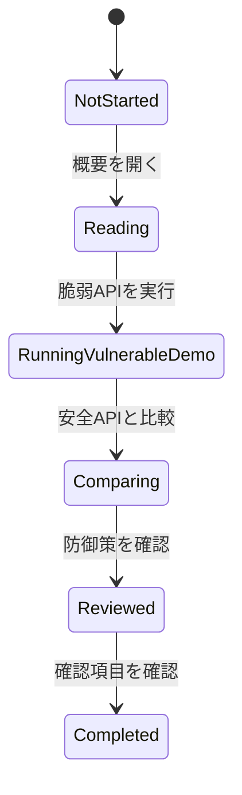

# APIセキュリティ学習・検証プラットフォーム 要件定義書

## 機能要件

| ID    | 要件                    | 概要                                                                     |
| ----- | ----------------------- | ------------------------------------------------------------------------ |
| FR-01 | 学習テーマ一覧          | APIセキュリティの学習テーマを一覧表示できる。                            |
| FR-02 | 脆弱APIデモ             | ローカル限定で脆弱なAPI例を実行できる。                                  |
| FR-03 | 安全APIデモ             | 同じテーマに対する安全な実装例を実行できる。                             |
| FR-04 | 比較表示                | 脆弱な例と安全な例のリクエスト、レスポンス、設計差分を比較できる。       |
| FR-05 | BOLAシナリオ            | オブジェクトレベル認可不備の例と対策を確認できる。                       |
| FR-06 | 認証シナリオ            | 認証不備やトークン管理の問題と対策を確認できる。                         |
| FR-07 | レート制限シナリオ      | 過剰リクエストを制限する設計を確認できる。                               |
| FR-08 | 業務フローシナリオ      | 重要な予約・購入フローの過剰利用やフロー飛ばしの問題と対策を確認できる。 |
| FR-09 | Mass Assignmentシナリオ | 許可されていないプロパティ更新の問題と対策を確認できる。                 |
| FR-10 | SSRFシナリオ            | 外部URL取得時の危険性と防御策を確認できる。                              |
| FR-11 | APIインベントリシナリオ | 旧APIや管理外APIを実行可能な状態で残す問題と対策を確認できる。           |
| FR-12 | 外部API応答シナリオ     | 外部API応答を過信する問題と、信頼境界で検証する対策を確認できる。        |
| FR-13 | 言語切替                | すべての画面で日本語と英語を切り替えられる。初期表示は日本語とする。     |

## 非機能要件

- 脆弱なAPIはローカル実行限定とする。
- 脆弱なAPIと安全なAPIはルート、表示、説明で明確に分離する。
- 公開環境へのデプロイを前提にしない。
- 学習画面はデスクトップとモバイルで閲覧できる。
- 警告、エラー、成功状態を利用者が理解しやすい形で表示する。

## セキュリティ要件

| ID    | 要件           | 内容                                                                                                                            |
| ----- | -------------- | ------------------------------------------------------------------------------------------------------------------------------- |
| SR-01 | ローカル限定   | 脆弱APIを公開環境へデプロイしてはいけないことをREADMEと画面に明記する。                                                         |
| SR-02 | ルート分離     | 脆弱APIと安全APIを明確に分離し、誤利用を防ぐ。                                                                                  |
| SR-03 | 認可検証       | 安全APIではユーザーと対象リソースの関係を必ず検証する。                                                                         |
| SR-04 | 入力検証       | リクエストボディ、クエリ、URLをスキーマで検証する。                                                                             |
| SR-05 | レート制限     | 安全APIでは過剰リクエストを制限する。                                                                                           |
| SR-06 | 業務フロー制御 | 安全APIでは重要な業務フローの順序、ユーザー単位上限、在庫制約を検証する。                                                       |
| SR-07 | SSRF対策       | 実ネットワークアクセスは行わず、URL検証プレビューで許可リスト、プライベートホスト拒否、リダイレクト方針を確認できるようにする。 |
| SR-08 | API管理        | 安全APIではAPIの環境、バージョン、公開範囲、所有者、退役状態、保護策の適用状況を確認する。                                      |
| SR-09 | 外部応答検証   | 外部API応答を信頼境界外の入力として扱い、提供元、リダイレクト先、応答スキーマ、権限フィールドを検証する。                       |
| SR-10 | 秘密情報管理   | `.env`、鍵、トークンをGit管理対象に含めない。                                                                                   |

## 検証要件

- 公開環境相当の設定では、すべての脆弱APIが無効化されることをテストで確認する。
- 安全APIでは、BOLA、認証不備、レート制限不足、業務フロー悪用、Mass Assignment、SSRF、旧API管理不備、外部API応答の過信が再現しないことを確認する。
- SSRFデモでは、脆弱APIと安全APIのどちらも実際の外部ネットワークアクセスを行わないことを確認する。
- APIインベントリデモでは、脆弱APIと安全APIのどちらも実トークン発行や通知送信を行わないことを確認する。
- 外部API応答デモでは、脆弱APIと安全APIのどちらも実際の外部API通信を行わないことを確認する。
- OpenAPI仕様に、実装済みAPIのルート、入力、エラーレスポンス、安全上の注意が記述されていることを確認する。
- 日本語表示と英語表示で、画面内の文言が同じ言語に統一されていることを確認する。

## 学習モジュール状態遷移

## UI/UX要件

- 脆弱なAPIを実行する画面には明確な警告を表示する。
- 脆弱な例と安全な例は色、ラベル、説明で区別する。
- リクエスト例とレスポンス例は比較しやすいレイアウトにする。
- 全画面共通の言語切替を配置する。
- 日本語表示時は画面内のUIテキストを日本語に統一する。
- 英語表示時は画面内のUIテキストを英語に統一する。
- API、BOLA、SSRF、CVSS、CWE、OWASPなど、日本語表示でも一般的に英語で使われる技術用語は英語表記を許容する。
