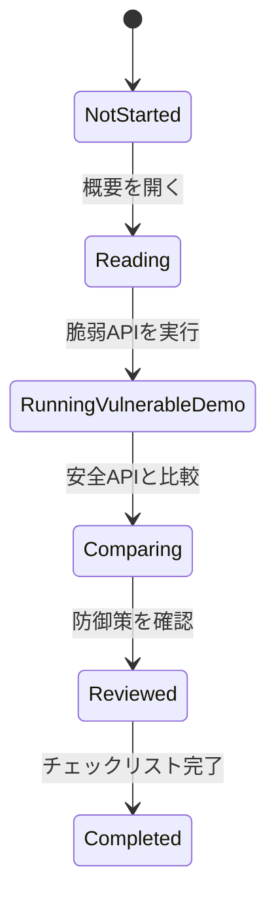

# APIセキュリティ学習・検証プラットフォーム 要件定義書

## 機能要件

| ID | 要件 | 概要 |
|---|---|---|
| FR-01 | 学習テーマ一覧 | APIセキュリティの学習テーマを一覧表示できる。 |
| FR-02 | 脆弱APIデモ | ローカル限定で脆弱なAPI例を実行できる。 |
| FR-03 | 安全APIデモ | 同じテーマに対する安全な実装例を実行できる。 |
| FR-04 | 比較表示 | 脆弱例と安全例のリクエスト、レスポンス、設計差分を比較できる。 |
| FR-05 | BOLAシナリオ | オブジェクトレベル認可不備の例と対策を確認できる。 |
| FR-06 | 認証シナリオ | 認証不備やトークン管理の問題と対策を確認できる。 |
| FR-07 | レート制限シナリオ | 過剰リクエストを制限する設計を確認できる。 |
| FR-08 | Mass Assignmentシナリオ | 許可されていないプロパティ更新の問題と対策を確認できる。 |
| FR-09 | SSRFシナリオ | 外部URL取得時の危険性と防御策を確認できる。 |
| FR-10 | 言語切替 | すべての画面で日本語と英語を切り替えられる。初期表示は日本語とする。 |

## 非機能要件

- 脆弱なAPIはローカル実行限定とする。
- 脆弱なAPIと安全なAPIはルート、表示、説明で明確に分離する。
- 公開環境へのデプロイを前提にしない。
- 学習画面はデスクトップとモバイルで閲覧できる。
- 警告、エラー、成功状態を利用者が理解しやすい形で表示する。

## セキュリティ要件

| ID | 要件 | 内容 |
|---|---|---|
| SR-01 | ローカル限定 | 脆弱APIは公開デプロイ禁止であることをREADMEと画面に明記する。 |
| SR-02 | ルート分離 | 脆弱APIと安全APIを明確に分離し、誤利用を防ぐ。 |
| SR-03 | 認可検証 | 安全APIではユーザーと対象リソースの関係を必ず検証する。 |
| SR-04 | 入力検証 | リクエストボディ、クエリ、URLをスキーマで検証する。 |
| SR-05 | レート制限 | 安全APIでは過剰リクエストを制限する。 |
| SR-06 | SSRF対策 | 外部URL取得時は許可リスト、IP範囲制限、リダイレクト制御を行う。 |
| SR-07 | 秘密情報管理 | `.env`、鍵、トークンをGit管理対象に含めない。 |

## 学習モジュール状態遷移

## UI/UX要件

- 脆弱なAPIを実行する画面には明確な警告を表示する。
- 脆弱例と安全例は色、ラベル、説明で区別する。
- リクエスト例とレスポンス例は比較しやすいレイアウトにする。
- 全画面共通の言語切替を配置する。
- 日本語表示時は画面内のUIテキストを日本語に統一する。
- 英語表示時は画面内のUIテキストを英語に統一する。
- 技術用語として一般的なAPI、BOLA、SSRF、CVSS、CWE、OWASPなどは日本語表示時でも英語表記を許容する。
